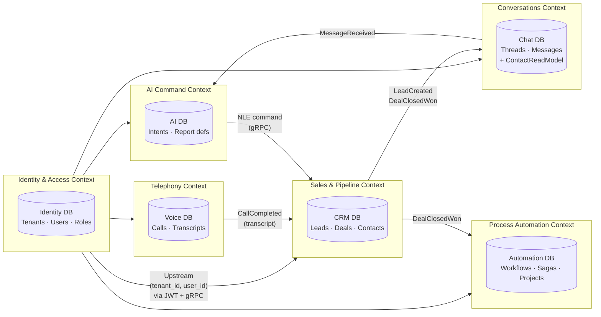
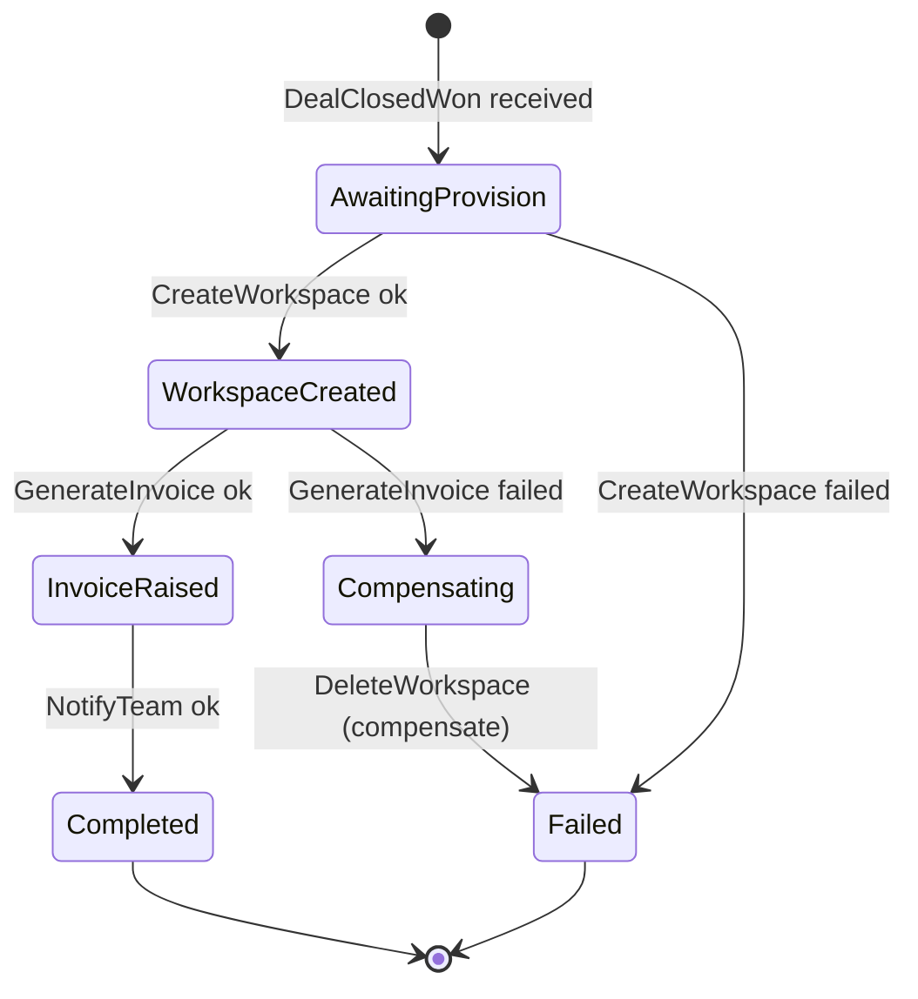

# NexConvo — Architectural Design Document

**Version:** 2.0.0
**Date:** 2026-06-20
**Status:** Approved (redesign — true microservices)

> **What changed from v1.0:** v1.0 was a *distributed monolith* — all six services shared a single PostgreSQL database and a heavyweight `SharedKernel` with a shared `DbContext`. v2.0 enforces **database-per-service** (genuine service autonomy), **orchestration-based Sagas** for distributed transactions, and a **test-first (TDD) discipline** with a defined testing pyramid and contract testing between services.

---

## Table of Contents

1. [Project Overview](#1-project-overview)
2. [Tech Stack](#2-tech-stack)
3. [Microservice Design Principles](#3-microservice-design-principles)
4. [Bounded Context Map (DDD)](#4-bounded-context-map-ddd)
5. [High-Level System Architecture](#5-high-level-system-architecture)
6. [Clean Architecture Solution Structure](#6-clean-architecture-solution-structure)
7. [Data & Multi-Tenancy Strategy (Database-per-Service)](#7-data--multi-tenancy-strategy-database-per-service)
8. [Inter-Service Communication & Saga Orchestration](#8-inter-service-communication--saga-orchestration)
9. [Event-Driven & Resiliency Blueprint](#9-event-driven--resiliency-blueprint)
10. [Observability Strategy](#10-observability-strategy)
11. [Testing Strategy (TDD)](#11-testing-strategy-tdd)
12. [Key Architectural Decisions](#12-key-architectural-decisions)

---

## 1. Project Overview

**NexConvo** is an AI-native, multi-tenant SaaS CRM platform engineered as an autonomous "system of action." It unifies omnichannel communication, automates project workflows post-deal-closure, and operates with zero-touch data entry via AI NLU entity extraction — with first-class Bengali support for the APAC/Bangladesh market.

**Architecture Style:** Distributed Microservices, Domain-Driven Design (DDD), Event-Driven, Multi-tenant SaaS.

**Core Services (each = one bounded context, each owns its own database):**

| # | Service | Bounded Context | Owns |
|---|---|---|---|
| 1 | Identity & Tenant Service | Identity & Access | Tenants, Users, Roles, Permissions |
| 2 | Core CRM Service | Sales & Pipeline | Leads, Deals, Contacts, Custom Fields |
| 3 | Omnichannel Chat Service | Conversations | Channels, Threads, Messages, Escalations |
| 4 | Voice Orchestration Service | Telephony | Campaigns, Calls, Transcripts, Dispositions |
| 5 | Automation & Workflow Worker | Process Automation | Workflows, Sagas, Projects, Milestones |
| 6 | Global AI Command Service | AI Command & BI | NLE intents, Report definitions, Config changes |

---

## 2. Tech Stack

| Layer | Technology |
|---|---|
| API Gateway | YARP 2.x (routing, rate limiting, load balancing) |
| Backend | .NET 9 (C#) Microservices — target `net9.0` |
| Internal Comms (Sync) | gRPC (Grpc.AspNetCore) + Pact contract tests |
| Internal Comms (Async) | RabbitMQ 3.13 + MassTransit 8 (events + Sagas) |
| Frontend | Next.js 15 App Router + React + Tailwind CSS |
| Database & ORM | **PostgreSQL 16 per service** + EF Core 9 (RLS + JSONB) |
| Real-time | ASP.NET Core SignalR + Redis 7 (backplane) |
| Caching | Redis 7 (distributed cache + distributed locks) |
| Background Jobs | Hangfire 1.8 |
| CQRS / Mediator | MediatR 12 |
| Validation | FluentValidation 11 |
| Resiliency | Polly 8 (Circuit Breaker + Retry + Timeout) |
| Logging | Serilog → Seq / ELK Stack |
| Tracing | OpenTelemetry .NET SDK → Prometheus + Grafana |
| Testing | xUnit, FluentAssertions, NSubstitute, TestContainers, Pact, WireMock.NET, Respawn |
| AI Voice | Vapi + OpenRouter + Deepgram Nova-3 (STT) + Cartesia Sonic 3 (TTS) |
| SMS | Twilio (NA/EU) · BulkSMSBD/MimSMS (+880) |
| Email | Resend/Postmark (transactional) · Amazon SES (marketing) |
| Containers | Docker (local) → Kubernetes with HPA (production, per-service) |

---

## 3. Microservice Design Principles

These principles are what make this a **true** microservice architecture rather than a distributed monolith. They are hard constraints.

| # | Principle | Rule |
|---|---|---|
| 1 | **Database-per-service** | Each service owns a **private PostgreSQL database**. No other service may read or write it — not even via SQL view. Data is shared *only* through published events and gRPC contracts. |
| 2 | **No shared database, no shared tables** | Cross-service `JOIN` is architecturally impossible. There is no "leads" table visible to Chat or Voice. |
| 3 | **Autonomy & independent deployability** | Each service builds, tests, versions, deploys, and scales (HPA) independently. A deploy of CRM never requires redeploying Chat. |
| 4 | **Eventual consistency over distributed ACID** | Cross-service consistency is achieved with **orchestration Sagas + compensating actions**, never two-phase commit (2PC). |
| 5 | **Smart endpoints, dumb pipes** | Business logic lives in services. RabbitMQ only transports messages — no logic in the broker. |
| 6 | **Data duplication is intentional** | A service caches the slices of other contexts it needs (e.g. Chat keeps a thin `ContactReadModel`) via events. Duplication buys autonomy. |
| 7 | **Minimal shared code** | Only two shared libraries exist: `NexConvo.Contracts` (event/DTO records) and a thin, stable `NexConvo.BuildingBlocks` (cross-cutting primitives). Sharing *infrastructure code* is allowed; sharing a *database* is not. |
| 8 | **Clean Architecture per service** | Every service internally separates Domain → Application → Infrastructure → API. |
| 9 | **API composition for cross-context reads** | A read that spans services is composed at the gateway/BFF or via a denormalized read model — never via a cross-service DB join. |
| 10 | **Multi-tenancy within each service DB** | Each per-service database is multi-tenant via PostgreSQL RLS. Per-*service* DB ≠ per-*tenant* DB — this honors the cost model while keeping services autonomous. |

> **Trade-off acknowledged:** Database-per-service costs more operationally (6 databases, eventual consistency, data duplication, distributed debugging) than a shared DB. We accept this in exchange for independent deployability, fault isolation, and the ability to scale hot services (Chat, Voice) independently of cold ones (Identity).

---

## 4. Bounded Context Map (DDD)

Each service is a bounded context. The map shows **how contexts relate** and which is upstream/downstream.



**Relationship patterns:**
- **Identity → all** = *Conformist / Upstream–Downstream*. Identity is the single source of truth for tenant & user; downstream services trust the JWT it issues and validate via gRPC.
- **CRM → Chat / Automation** = *Customer–Supplier* via domain events (CRM supplies, others consume).
- **Voice → CRM** = *Open Host Service*. Voice publishes `CallCompleted`; CRM's NLU consumer extracts entities.
- **AI → CRM** = *Anti-Corruption Layer*. AI parses natural language into typed commands before crossing into CRM (never raw LLM output).

---

## 5. High-Level System Architecture

```mermaid
graph TB
    subgraph ClientLayer["Client Layer"]
        NC["Next.js 15 App Router\nReact + Tailwind\nSignalR WebSocket client"]
    end

    subgraph GatewayLayer["API Gateway / BFF"]
        YARP["YARP Reverse Proxy\nJWT validation · Rate limiting\nAPI composition for cross-service reads\nOTel root span injection"]
    end

    subgraph ServiceLayer["Microservices — each independently deployable (own K8s Deployment + HPA)"]
        IS["Identity & Tenant Service\ngRPC · JWT issuance · RBAC"]
        CRM["Core CRM Service\nCQRS/MediatR · gRPC + REST"]
        CHAT["Omnichannel Chat Service\nSignalR hub · gRPC"]
        VOICE["Voice Orchestration Service\nHangfire · gRPC"]
        AUTO["Automation & Workflow Worker\nMassTransit Saga state machine"]
        AI["Global AI Command Service\nNLE engine · gRPC"]
    end

    subgraph DataLayer["Data Layer — DATABASE PER SERVICE (no sharing)"]
        IDDB[("Identity DB\nPG16 + RLS")]
        CRMDB[("CRM DB\nPG16 + RLS + JSONB/GIN")]
        CHATDB[("Chat DB\nPG16 + RLS")]
        VOICEDB[("Voice DB\nPG16 + RLS")]
        AUTODB[("Automation DB\nPG16 + RLS + Saga state")]
        AIDB[("AI DB\nPG16 + RLS")]
        REDIS[("Redis 7\nSignalR backplane · cache · locks")]
    end

    subgraph BrokerLayer["Message Broker"]
        MQ["RabbitMQ 3.13 + MassTransit 8\nevents · Sagas · outbox/inbox · DLQ"]
    end

    subgraph Obs["Observability (cross-cutting)"]
        OTC["OTel Collector"]
        SEQ["Seq / ELK"]
        PROM["Prometheus + Grafana"]
    end

    subgraph Ext["External APIs — all Polly-wrapped (CB + Retry)"]
        VAPI["Vapi"]
        OR["OpenRouter"]
        DG["Deepgram Nova-3"]
        CAR["Cartesia Sonic 3"]
        META["Meta Graph API"]
        SMS["Twilio / BulkSMSBD"]
        MAIL["Resend / SES"]
    end

    NC -->|HTTPS / WSS| YARP
    YARP -->|gRPC validate| IS
    YARP -->|gRPC / REST| CRM
    YARP -->|WS upgrade| CHAT
    YARP -->|gRPC| VOICE
    YARP -->|gRPC| AI

    IS --> IDDB
    CRM --> CRMDB
    CHAT --> CHATDB
    VOICE --> VOICEDB
    AUTO --> AUTODB
    AI --> AIDB
    CHAT --> REDIS

    CRM -->|publish| MQ
    CHAT -->|publish| MQ
    VOICE -->|publish| MQ
    MQ -->|DealClosedWon → start Saga| AUTO
    MQ -->|CallCompleted → NLU| CRM
    MQ -->|MessageReceived → AI reply| CHAT
    AUTO -->|Saga commands\n(gRPC/events)| CRM
    AUTO -->|Saga commands| CHAT

    VOICE -->|Polly| VAPI
    VOICE -->|Polly| OR
    VOICE -->|Polly| DG
    VOICE -->|Polly| CAR
    CHAT -->|Polly| META
    CRM -->|Polly prefix-route| SMS
    CRM -->|Polly dual-pool| MAIL

    IS -.->|OTel| OTC
    CRM -.->|OTel| OTC
    CHAT -.->|OTel| OTC
    VOICE -.->|OTel| OTC
    AUTO -.->|OTel| OTC
    OTC -.-> SEQ
    OTC -.-> PROM
```

**The critical visual difference from v1.0:** there are now **six separate databases**, one per service. No service arrow points at another service's database.

---

## 6. Clean Architecture Solution Structure

Each service is its own `.sln` with four layers + tests. Core CRM is the reference; all services follow this shape with their own aggregates.

```
src/
├── gateway/
│   └── NexConvo.Gateway/                          # YARP + API composition (BFF reads)
│
├── shared/                                        # ONLY these two are shared — kept thin & stable
│   ├── NexConvo.Contracts/                        # Integration events + cross-service DTOs (versioned)
│   └── NexConvo.BuildingBlocks/                   # ITenantContext, Result<T>, base aggregate, Polly + OTel helpers
│
└── services/
    └── CoreCrm/
        ├── NexConvo.CoreCrm.sln
        ├── src/
        │   ├── NexConvo.CoreCrm.Domain/            # LAYER 1 — zero external deps
        │   │   ├── Aggregates/
        │   │   │   ├── Leads/  { Lead.cs · LeadStatus.cs · LeadDomainEvents.cs }
        │   │   │   ├── Deals/  { Deal.cs · DealStage.cs · DealDomainEvents.cs }
        │   │   │   └── Contacts/ { Contact.cs }
        │   │   ├── ValueObjects/ { Email.cs · PhoneNumber.cs · Money.cs }
        │   │   ├── Interfaces/  { ILeadRepository.cs · IDealRepository.cs }
        │   │   └── Exceptions/  { DomainException.cs }
        │   │
        │   ├── NexConvo.CoreCrm.Application/        # LAYER 2 — depends on Domain only
        │   │   ├── Common/
        │   │   │   ├── Interfaces/ { ICrmDbContext.cs · IIntegrationEventPublisher.cs · ICacheService.cs }
        │   │   │   └── Behaviors/  { ValidationBehavior.cs · LoggingBehavior.cs · CachingBehavior.cs }
        │   │   ├── Features/
        │   │   │   ├── Leads/
        │   │   │   │   ├── Commands/ { CreateLead/ · UpdateLeadStatus/ · MergeLeads/ }
        │   │   │   │   └── Queries/  { GetLeadById/ · GetLeadsPaged/ }
        │   │   │   └── Deals/
        │   │   │       ├── Commands/ { CreateDeal/ · AdvanceDealStage/ }
        │   │   │       └── Queries/  { GetDealPipeline/ }
        │   │   └── DependencyInjection.cs           # AddApplication()
        │   │
        │   ├── NexConvo.CoreCrm.Infrastructure/     # LAYER 3 — depends on Application
        │   │   ├── Persistence/
        │   │   │   ├── CrmDbContext.cs              # OWN DbContext — CRM DB only
        │   │   │   ├── Configurations/ { LeadConfiguration.cs · DealConfiguration.cs }
        │   │   │   ├── Migrations/
        │   │   │   └── Outbox/                       # MassTransit EF outbox tables
        │   │   ├── Repositories/ { LeadRepository.cs · DealRepository.cs }
        │   │   ├── Messaging/
        │   │   │   ├── Consumers/ { CallCompletedConsumer.cs }   # NLU extraction
        │   │   │   └── IntegrationEventPublisher.cs              # publish post-commit via outbox
        │   │   ├── ReadModels/ { ContactReadModel.cs }           # data duplicated from other contexts
        │   │   ├── ExternalServices/
        │   │   │   ├── Sms/   { TwilioSmsGateway.cs · BulkSmsBdGateway.cs }  # Polly-wrapped
        │   │   │   └── Email/ { ResendEmailSender.cs · SesEmailSender.cs }    # dual-pool
        │   │   └── DependencyInjection.cs           # AddInfrastructure()
        │   │
        │   └── NexConvo.CoreCrm.API/                # LAYER 4 — depends on Infrastructure
        │       ├── Controllers/ { LeadsController.cs · DealsController.cs }
        │       ├── GrpcServices/ { CrmGrpcService.cs }
        │       ├── Middleware/ { ExceptionHandlingMiddleware.cs }  # RFC 7807 ProblemDetails
        │       ├── Program.cs · appsettings.json · Dockerfile
        │
        └── tests/                                   # see §11 Testing Strategy
            ├── NexConvo.CoreCrm.Domain.Tests/        # unit — pure, no I/O
            ├── NexConvo.CoreCrm.Application.Tests/   # unit — handlers, mocked deps
            ├── NexConvo.CoreCrm.Contract.Tests/      # Pact — provider/consumer contracts
            └── NexConvo.CoreCrm.Integration.Tests/   # TestContainers — real CRM DB + Redis
```

**Layer dependency rules (compile-time enforced via `.csproj`):** `Domain` (no refs) ← `Application` ← `Infrastructure` ← `API`.

---

## 7. Data & Multi-Tenancy Strategy (Database-per-Service)

### Two orthogonal isolation axes

```
                 Service isolation (microservices)
                 ───────────────────────────────►
                 Identity DB │ CRM DB │ Chat DB │ ...   (one PG database each)
   Tenant   ▲    ──────────────────────────────────
  isolation │      RLS         RLS      RLS            (within each DB, rows
   (RLS)    │    tenant A     tenant A  tenant A        filtered by tenant_id)
            │    tenant B     tenant B  tenant B
```

- **Service isolation** = each microservice connects to a *different* PostgreSQL database with a *different* connection string. No cross-service connection exists.
- **Tenant isolation** = inside each service DB, RLS filters every row by `tenant_id` from the JWT. This is unchanged from v1.0 and still honors CLAUDE.md ("no per-tenant DB instances").

### Per-service DbContext (no shared base across services)

Each service owns its `DbContext`. The *only* shared piece is the `ITenantContext` interface and a small `TenantInterceptor` from `BuildingBlocks` — infrastructure code, not a database.

```csharp
// BuildingBlocks/Multitenancy/ITenantContext.cs
public interface ITenantContext { Guid TenantId { get; } }

// BuildingBlocks/Multitenancy/HttpTenantContext.cs
public sealed class HttpTenantContext(IHttpContextAccessor http) : ITenantContext
{
    public Guid TenantId =>
        Guid.TryParse(http.HttpContext?.User.FindFirst("tenant_id")?.Value, out var id)
            ? id
            : throw new UnauthorizedAccessException("Missing tenant_id claim.");
}

// BuildingBlocks/Multitenancy/RlsConnectionInterceptor.cs
// Sets the PostgreSQL session var on every connection open — RLS enforcement
public sealed class RlsConnectionInterceptor(ITenantContext tenant) : DbConnectionInterceptor
{
    public override async Task ConnectionOpenedAsync(
        DbConnection connection, ConnectionEndEventData e, CancellationToken ct = default)
    {
        await using var cmd = connection.CreateCommand();
        cmd.CommandText = "SET app.current_tenant_id = @tid";
        var p = cmd.CreateParameter();
        p.ParameterName = "@tid"; p.Value = tenant.TenantId.ToString();
        cmd.Parameters.Add(p);
        await cmd.ExecuteNonQueryAsync(ct);
    }
}
```

```csharp
// CoreCrm.Infrastructure/Persistence/CrmDbContext.cs — CRM's OWN database
public sealed class CrmDbContext(DbContextOptions<CrmDbContext> options, ITenantContext tenant)
    : DbContext(options), ICrmDbContext
{
    public DbSet<Lead> Leads => Set<Lead>();
    public DbSet<Deal> Deals => Set<Deal>();
    public DbSet<Contact> Contacts => Set<Contact>();

    protected override void OnModelCreating(ModelBuilder b)
    {
        b.ApplyConfigurationsFromAssembly(typeof(CrmDbContext).Assembly);

        // App-level safety net mirroring RLS — applied to every ITenantEntity
        foreach (var et in b.Model.GetEntityTypes()
                     .Where(t => typeof(ITenantEntity).IsAssignableFrom(t.ClrType)))
        {
            b.Entity(et.ClrType).HasQueryFilter(
                TenantFilter.Build(et.ClrType, tenant));   // helper in BuildingBlocks
        }
    }

    public override Task<int> SaveChangesAsync(CancellationToken ct = default)
    {
        foreach (var e in ChangeTracker.Entries<ITenantEntity>()
                     .Where(x => x.State == EntityState.Added))
            e.Entity.TenantId = tenant.TenantId;
        return base.SaveChangesAsync(ct);
    }
}
```

```csharp
// JSONB + GIN config — custom fields (CLAUDE.md: never EAV)
public sealed class LeadConfiguration : IEntityTypeConfiguration<Lead>
{
    public void Configure(EntityTypeBuilder<Lead> b)
    {
        b.ToTable("leads");
        b.Property(l => l.TenantId).HasColumnName("tenant_id").IsRequired();
        b.Property(l => l.Status).HasConversion<string>().HasMaxLength(50);
        b.Property(l => l.CustomFields).HasColumnType("jsonb").HasColumnName("custom_fields");
        b.HasIndex(l => new { l.TenantId, l.Status });
        b.HasIndex("custom_fields").HasMethod("gin")
            .HasAnnotation("Npgsql:IndexOperators", new[] { "jsonb_path_ops" });
    }
}
```

```sql
-- Per-service DB migration — RLS policy on every tenant table
ALTER TABLE leads ENABLE ROW LEVEL SECURITY;
CREATE POLICY tenant_isolation ON leads
    USING (tenant_id = current_setting('app.current_tenant_id')::uuid);
-- Each service connects with its OWN non-superuser role
GRANT SELECT, INSERT, UPDATE, DELETE ON leads TO crm_service;
```

> **Cross-service data:** Chat needs contact names but **cannot read CRM's DB**. Instead Chat keeps a `ContactReadModel` in its *own* DB, populated by consuming `LeadCreated`/`ContactUpdated` events. Stale-but-autonomous beats fresh-but-coupled.

---

## 8. Inter-Service Communication & Saga Orchestration

### Communication styles

| Style | Transport | When |
|---|---|---|
| **Sync query** | gRPC | Read another context's data *right now* (e.g. gateway validates token against Identity). Typed `.proto`, Polly-wrapped, Pact-tested. |
| **Async event** | RabbitMQ + MassTransit | Notify that something happened; fire-and-forget; fan-out. |
| **Async command (Saga)** | RabbitMQ + MassTransit Saga | Coordinate a *multi-step, multi-service* business transaction with rollback. |

### Orchestration Saga — "Closed-Won → Project Provisioning"

When a deal closes, NexConvo must (atomically, across services): create a project workspace, generate the first invoice, and notify the team. There is **no distributed ACID transaction** — instead the **Automation service runs a Saga state machine** that issues commands and applies **compensating actions** if any step fails.



```csharp
// AutomationWorker — MassTransit Saga state machine
public sealed class ProjectProvisioningState : SagaStateMachineInstance
{
    public Guid CorrelationId { get; set; }   // = DealId
    public Guid TenantId { get; set; }
    public string CurrentState { get; set; } = default!;
    public Guid? WorkspaceId { get; set; }
    public Guid? InvoiceId { get; set; }
}

public sealed class ProjectProvisioningSaga
    : MassTransitStateMachine<ProjectProvisioningState>
{
    public State AwaitingProvision { get; private set; } = default!;
    public State WorkspaceCreated { get; private set; } = default!;
    public State InvoiceRaised   { get; private set; } = default!;

    public Event<DealClosedWonIntegrationEvent> DealClosed { get; private set; } = default!;
    public Event<WorkspaceCreated>              Workspace  { get; private set; } = default!;
    public Event<InvoiceRaised>                 Invoice    { get; private set; } = default!;
    public Event<ProvisioningStepFailed>        StepFailed { get; private set; } = default!;

    public ProjectProvisioningSaga()
    {
        InstanceState(x => x.CurrentState);

        Event(() => DealClosed, e => e.CorrelateById(c => c.Message.DealId));

        Initially(
            When(DealClosed)
                .Then(c => { c.Saga.TenantId = c.Message.TenantId; })
                .Send(new Uri("queue:create-workspace"),
                      c => new CreateWorkspace(c.Message.DealId, c.Message.TenantId))
                .TransitionTo(AwaitingProvision));

        During(AwaitingProvision,
            When(Workspace)
                .Then(c => c.Saga.WorkspaceId = c.Message.WorkspaceId)
                .Send(new Uri("queue:generate-invoice"),
                      c => new GenerateInvoice(c.Saga.CorrelationId, c.Saga.TenantId))
                .TransitionTo(WorkspaceCreated),
            When(StepFailed).TransitionTo(InvoiceRaised).Finalize());   // nothing to undo yet

        During(WorkspaceCreated,
            When(Invoice)
                .Then(c => c.Saga.InvoiceId = c.Message.InvoiceId)
                .Send(new Uri("queue:notify-team"),
                      c => new NotifyTeam(c.Saga.CorrelationId, c.Saga.TenantId))
                .Finalize(),
            When(StepFailed)                                            // COMPENSATE
                .Send(new Uri("queue:delete-workspace"),
                      c => new DeleteWorkspace(c.Saga.WorkspaceId!.Value, c.Saga.TenantId))
                .Finalize());

        SetCompletedWhenFinalized();
    }
}
```

**Saga state persists in the Automation DB** (`AddEntityFrameworkOutbox` + saga repository), so a crash mid-flow resumes correctly. This replaces any 2PC across services.

### Reliable messaging — Outbox / Inbox

- **Outbox:** the integration event is written to the *same* DB transaction as the aggregate change, then relayed to RabbitMQ by a background dispatcher → no "committed but never published" gaps.
- **Inbox:** consumers dedupe by `EventId` → idempotent, safe redelivery.

---

## 9. Event-Driven & Resiliency Blueprint

### Integration events (published post-commit via outbox)

```csharp
// NexConvo.Contracts/IntegrationEvent.cs
public abstract record IntegrationEvent
{
    public Guid EventId { get; } = Guid.NewGuid();
    public DateTimeOffset OccurredAt { get; } = DateTimeOffset.UtcNow;
    public string? CorrelationId { get; init; }   // W3C TraceId across boundaries
}

// EVENT 1 — Core CRM ▶ Chat (auto-reply) + AI (enrichment)
public sealed record LeadCreatedIntegrationEvent : IntegrationEvent
{
    public required Guid LeadId { get; init; }
    public required Guid TenantId { get; init; }
    public required string ContactName { get; init; }
    public string? Email { get; init; }
    public string? PhoneE164 { get; init; }
    public required LeadSourceChannel SourceChannel { get; init; }
    public JsonDocument? CustomFields { get; init; }
}

// EVENT 2 — Core CRM ▶ Automation (starts the provisioning Saga)
public sealed record DealClosedWonIntegrationEvent : IntegrationEvent
{
    public required Guid DealId { get; init; }
    public required Guid TenantId { get; init; }
    public required Guid ContactId { get; init; }
    public required Guid AssignedUserId { get; init; }
    public required decimal DealValue { get; init; }
    public required string CurrencyCode { get; init; }     // ISO 4217
    public required DateTimeOffset ClosedAt { get; init; }
}
```

### Polly Circuit Breaker — Voice Orchestration (Infrastructure layer only)

```csharp
public static IServiceCollection AddInfrastructure(
    this IServiceCollection services, IConfiguration cfg)
{
    static IAsyncPolicy<HttpResponseMessage> Retry() =>
        HttpPolicyExtensions.HandleTransientHttpError().Or<TimeoutRejectedException>()
            .WaitAndRetryAsync(3, a =>
                TimeSpan.FromMilliseconds(200 * Math.Pow(2, a))
                + TimeSpan.FromMilliseconds(Random.Shared.Next(0, 100)));

    static IAsyncPolicy<HttpResponseMessage> Breaker() =>
        HttpPolicyExtensions.HandleTransientHttpError()
            .CircuitBreakerAsync(
                handledEventsAllowedBeforeBreaking: 5,
                durationOfBreak: TimeSpan.FromSeconds(30),
                onBreak:    (_, d) => Log.Warning("Circuit OPEN {S}s", d.TotalSeconds),
                onReset:    ()     => Log.Information("Circuit CLOSED"),
                onHalfOpen: ()     => Log.Information("Circuit HALF-OPEN"));

    services.AddHttpClient<IVapiClient, VapiHttpClient>(c =>
        {
            c.BaseAddress = new Uri(cfg["Vapi:BaseUrl"]!);
            c.Timeout = TimeSpan.FromSeconds(10);
        })
        .AddPolicyHandler(Retry()).AddPolicyHandler(Breaker());

    services.AddHttpClient<ILlmClient, OpenRouterLlmClient>(c =>
        {
            c.BaseAddress = new Uri(cfg["OpenRouter:BaseUrl"]!);
            c.Timeout = TimeSpan.FromSeconds(45);     // streaming LLM is slow
        })
        .AddPolicyHandler(Retry()).AddPolicyHandler(Breaker());

    return services;
}
```

**Call stack:** `Application: IVapiClient` → `Infrastructure: VapiHttpClient` → named `HttpClient` (Polly intercepts here) → Vapi API. On open circuit, `BrokenCircuitException` is caught at the Application boundary → `Result.Failure("Voice provider unavailable")`.

---

## 10. Observability Strategy

A single `TraceId` follows a request from YARP, through services, **across RabbitMQ and the Saga**, into Hangfire.

```
[Browser] POST /api/crm/deals/{id}/close
[YARP]    root span · TraceId 4bf92f35... · inject W3C traceparent
[CRM]     child span "AdvanceDealStageHandler" · commit CRM DB · publish DealClosedWon (traceparent in AMQP headers)
[RabbitMQ ▶ Automation Saga] linked span "ProjectProvisioningSaga" (same TraceId) · persists saga state
[Automation ▶ CreateWorkspace] linked span · commit Automation DB
[Hangfire NotifyTeam job] TraceId carried in job arg · ActivityContext.Parse() reattaches span
→ Seq: every hop shares { "TraceId": "4bf92f35", "TenantId": "abc..." }
```

```csharp
// Serilog (per service — only "Service" differs)
Log.Logger = new LoggerConfiguration()
    .Enrich.FromLogContext()
    .Enrich.WithProperty("Service", "CoreCrm")
    .Enrich.WithOpenTelemetryTraceId()
    .WriteTo.Console(new RenderedCompactJsonFormatter())
    .WriteTo.Seq(cfg["Seq:Url"]!)
    .CreateLogger();

// OpenTelemetry
builder.Services.AddOpenTelemetry()
    .WithTracing(t => t
        .AddAspNetCoreInstrumentation()
        .AddGrpcClientInstrumentation()
        .AddEntityFrameworkCoreInstrumentation(o => o.SetDbStatementForText = true)
        .AddRedisInstrumentation()
        .AddSource("MassTransit")
        .AddOtlpExporter(o => o.Endpoint = new Uri(cfg["Otel:Endpoint"]!)))
    .WithMetrics(m => m
        .AddAspNetCoreInstrumentation().AddRuntimeInstrumentation().AddPrometheusExporter());

// Health checks — each service checks ONLY its own DB + dependencies
builder.Services.AddHealthChecks()
    .AddNpgsql(cfg.GetConnectionString("CrmDb")!, name: "crm-db")
    .AddRedis(cfg.GetConnectionString("Redis")!, name: "redis")
    .AddRabbitMQ(cfg["RabbitMQ:ConnectionString"]!, name: "rabbitmq");
```

---

## 11. Testing Strategy (TDD)

NexConvo is built **test-first**. No production code is written before a failing test exists for it (red → green → refactor). Tests are the executable specification and the regression safety net that makes independent, frequent deployments safe.

### The testing pyramid (per service)

```
              ▲  fewer, slower, higher-confidence
        ┌─────────────┐
        │  E2E / Smoke │   Whole stack via docker-compose; 1 happy path per critical journey
        ├─────────────┤
        │  Contract    │   Pact: every gRPC/event contract between a consumer & provider
        ├─────────────┤
        │ Integration  │   TestContainers: real PostgreSQL + Redis + RabbitMQ; handler → DB → event
        ├─────────────┤
        │     Unit      │   Domain invariants + Application handlers (mocked deps); the bulk
        └─────────────┘
              ▼  many, fast, run on every commit
```

### Layer responsibilities & tooling

| Layer | What it proves | Tooling | Speed / runs |
|---|---|---|---|
| **Unit — Domain** | Aggregate invariants & value-object rules (e.g. a `Deal` cannot move to `ClosedWon` twice; `PhoneNumber` rejects non-E.164). Pure, no I/O, no mocks. | xUnit + FluentAssertions | ms · every commit |
| **Unit — Application** | CQRS handler logic, validation, domain-event raising — with `ICrmDbContext`, repositories, publishers mocked. | xUnit + NSubstitute + FluentAssertions | ms · every commit |
| **Integration** | Handler → real EF Core → **real per-service PostgreSQL** (incl. RLS isolation) → outbox event emitted. External HTTP stubbed. | TestContainers (PG/Redis/RabbitMQ) + WireMock.NET + Respawn (reset) | sec · pre-merge |
| **Contract** | The shape & semantics of each gRPC call and integration event match between provider and consumer — catches breaking changes **without** spinning up both services. | Pact (PactNet) + Pact Broker | sec · pre-merge |
| **E2E / Smoke** | One real cross-service journey works end-to-end (e.g. close deal → Saga → project + invoice). | docker-compose + xUnit HTTP/SignalR clients | min · nightly + pre-release |

### TDD workflow (every feature, every bugfix)

1. **Red** — write the smallest failing test at the lowest layer that can express the requirement (Domain unit first when possible).
2. **Green** — write the minimum production code to pass. No more.
3. **Refactor** — clean up under green; tests stay green.
4. **Climb the pyramid only when needed** — add an integration test when persistence/RLS/eventing is involved; add a contract test when a service boundary changes.
5. **Commit** at each green+refactor — small, frequent commits.

### Multi-tenancy is a first-class test target

Tenant isolation has a dedicated `[Trait("Category","Security")]` integration suite: create a row as Tenant A, open a context as Tenant B, assert the row is invisible — proving **both** the EF query filter and the PostgreSQL RLS policy. A cross-tenant leak is a build-breaking failure, never a warning.

### CI quality gates (per service pipeline)

- Unit + Application tests must pass and meet a **line-coverage floor of 80%** on Domain + Application.
- Integration + Contract tests must pass before merge to `main`.
- Pact verification against the broker must be green — a provider cannot merge a change that breaks a published consumer contract.
- E2E smoke runs nightly and as a release gate.

---

## 12. Key Architectural Decisions

| Decision | Chosen | Rejected | Reason |
|---|---|---|---|
| Data ownership | **Database-per-service** | Shared database (v1.0) | True autonomy: independent deploy/scale/evolve; fault isolation; no cross-service coupling via DB |
| Multi-tenancy | RLS *within* each service DB | Per-tenant DB | Honors cost model (CLAUDE.md); per-service ≠ per-tenant — fully compatible |
| Cross-service consistency | **Orchestration Saga + compensation** | 2PC / distributed ACID | 2PC doesn't scale and couples services; Saga is observable with explicit rollback |
| Saga style | Orchestration (central state machine) | Choreography | Multi-step provisioning flow is explicit, traceable, and easy to reason about |
| Reliable messaging | Outbox + Inbox (MassTransit EF) | Direct publish | Eliminates dual-write gaps; idempotent redelivery |
| Cross-context reads | Local read models + API composition | Cross-service DB joins | Joins reintroduce coupling; duplication preserves autonomy |
| Sync internal comms | gRPC + Pact contract tests | REST, untested | Typed contracts; HTTP/2; contract tests catch breaking changes early |
| Async messaging | RabbitMQ + MassTransit | Kafka | Right-sized for SME scale; native saga/outbox/DLQ support |
| Custom fields | JSONB + GIN | EAV | 1000× faster at scale; schema-less evolution; ACID |
| Real-time | SignalR + Redis backplane | SSE / polling | Bi-directional; token streaming; horizontal scale |
| Resiliency | Polly 8 (CB + Retry) | Manual try/catch | Declarative, composable, OTel-integrated |
| Dev methodology | **Test-first (TDD)** + pyramid | Test-after | Tests as spec; safe independent/frequent deploys; regression net |
| AI voice | Vapi + OpenRouter + Deepgram + Cartesia | Single vendor | No lock-in; $0.08–0.10/min; native Bengali code-switching |
| Bangladesh SMS | BulkSMSBD/MimSMS (+880) | Twilio for all | 60–80% cost savings; reliable local routing |
| Email | Dual-pool (Resend + SES) | Single provider | Protects transactional sender reputation |
```
