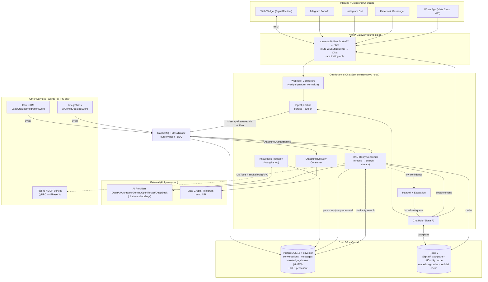
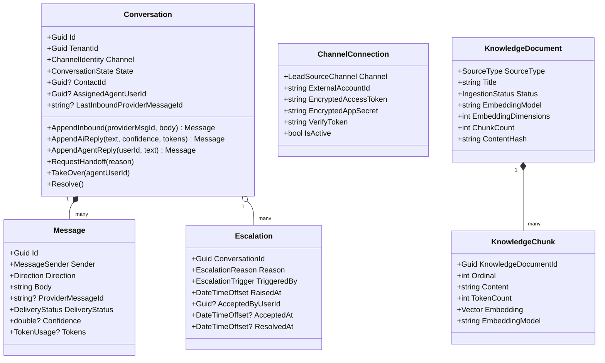
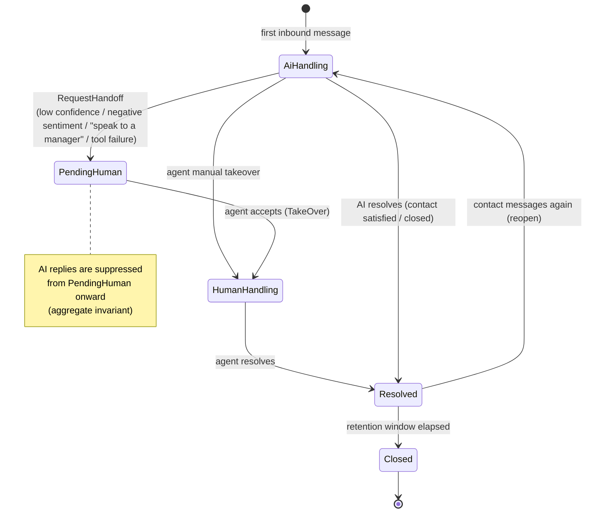
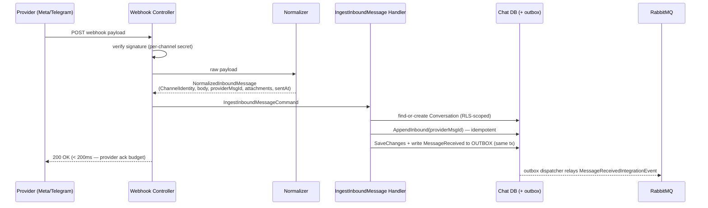
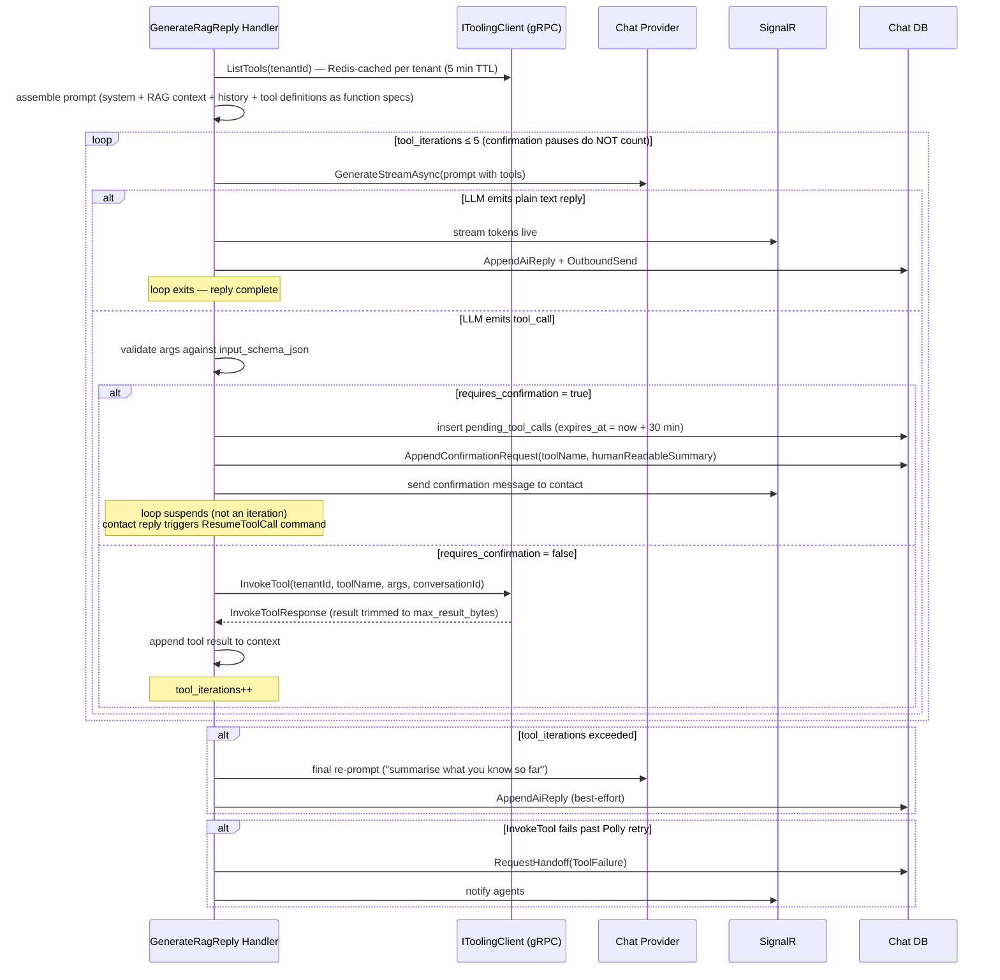
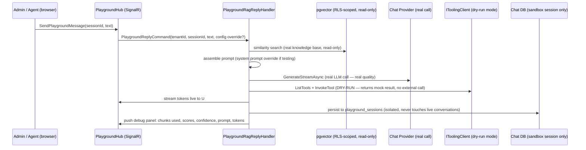

# NexConvo — Omnichannel AI Chatbot Architecture

**Version:** 1.0.0
**Date:** 2026-06-30
**Status:** Approved (design)
**Scope:** Internal architecture of the **Omnichannel Chat Service** (bounded context #3, database `nexconvo_chat`).

> This document describes **how the omnichannel AI chatbot works** — its components, their responsibilities, how they communicate, how data flows, and the persistence schema. It is a *design reference*, not a build plan. It assumes and conforms to `docs/ARCHITECTURE.md` (v2.0 — true microservices, database-per-service, RLS, outbox/inbox, SignalR+Redis, Polly) and the per-change discipline in the `nexconvo-enterprise-standards` skill.

---

## Table of Contents

1. [Overview & Scope](#1-overview--scope)
2. [Feature Set → Component Map](#2-feature-set--component-map)
3. [High-Level Architecture](#3-high-level-architecture)
4. [Domain Model](#4-domain-model)
5. [Conversation State Machine](#5-conversation-state-machine)
6. [Inbound Ingestion](#6-inbound-ingestion)
7. [RAG Reply Pipeline](#7-rag-reply-pipeline)
8. [Knowledge Ingestion ("Training")](#8-knowledge-ingestion-training)
9. [Human Handoff](#9-human-handoff)
10. [MCP / Tooling Boundary](#10-mcp--tooling-boundary) — [10.1 Why separate](#101-why-a-separate-tooling-microservice) · [10.2 Two kinds of MCP](#102-two-kinds-of-mcp-servers) · [10.3 Registry schema](#103-mcp-server-registry-persistence) · [10.4 gRPC contract](#104-grpc-contract) · [10.5 Agent loop](#105-agent-loop-in-chat-how-the-llm-decides-to-call-a-tool) · [10.6 Confirmation config](#106-per-tool-confirmation-config) · [10.7 Native servers](#107-nexconvo-native-mcp-servers-built-in) · [10.8 External servers](#108-external--custom-mcp-server-flow) · [10.9 Examples](#109-concrete-examples)
11. [Embeddings Extension](#11-embeddings-extension)
12. [pgvector Specifics](#12-pgvector-specifics)
13. [Persistence Schema (`nexconvo_chat`)](#13-persistence-schema-nexconvo_chat)
14. [Data Privacy & GDPR Compliance](#14-data-privacy--gdpr-compliance)
15. [Performance & Scale](#15-performance--scale)
16. [Reporting & Analytics](#16-reporting--analytics)
17. [Build Sequencing (Guidance)](#17-build-sequencing-guidance)
18. [Chatbot Test Playground](#18-chatbot-test-playground)
19. [Key Decisions](#19-key-decisions)

---

## 1. Overview & Scope

The **Omnichannel Chat Service** owns the *Conversations* bounded context: every inbound and outbound message across **WhatsApp, Facebook Messenger, Instagram, Telegram, and a first-party Web widget** (with the contract open to TikTok/LinkedIn/SMS/Email later), unified into one tenant-scoped store. On top of that store it runs an **AI agent** that:

- replies to each conversation using **per-workspace RAG** (Retrieval-Augmented Generation) grounded in that tenant's own knowledge,
- **escalates to a human agent** when answer quality is low, sentiment turns negative, or the contact asks for one,
- lets each workspace **"train" the bot** by uploading knowledge (docs, FAQs, product data, past chats) that is chunked and embedded into the tenant's vector store,
- (later) calls **MCP tools** (Gmail, Sheets, Meet, plus custom tools like "discount info" / "latest price") during a conversation.

It is **one bounded context**, so it owns one database and shares data with other services **only through events and gRPC** — never a cross-service DB join (ARCHITECTURE.md §3). It keeps a thin `contact_read_model` populated from CRM's `LeadCreatedIntegrationEvent` so it can show contact names without reading CRM's database.

**What this service does NOT own:** identity/tenancy (Identity service), leads/deals (CRM), voice calls (Voice), the AI *provider credentials* (Integrations service owns `WorkspaceAiConfig`), and MCP tool execution (a separate Tooling service).

### Reused foundations (already in the codebase — this service builds on them, it does not reinvent them)

| Foundation | Location | Used for |
|---|---|---|
| `IAiProviderService.GenerateStreamAsync(...)` → `IAsyncEnumerable<AiStreamChunk>` | `src/shared/NexConvo.BuildingBlocks.Ai/Services/` | Streaming LLM replies |
| `AiProviderFactory` + 5 providers (OpenAI, Anthropic, Gemini, OpenRouter, DeepSeek) | same | Provider-agnostic calls |
| `ITokenUsageLogger` + `AiTokenUsageReportedEvent` | same / Contracts | Per-tenant cost metering |
| `WorkspaceAiConfig` + `AiConfigUpdatedEvent` | Integrations service / Contracts | Per-workspace provider, model, system prompt, encrypted key |
| `AiConfigUpdatedEventConsumer` (caches `AiConfig:{TenantId}` in Redis, 24h TTL, **encrypted** key) | `src/services/Chat/.../Features/AiConfig/EventHandlers/` | Hot config lookup at reply time |
| `AesEncryptionService` (AES-256) | `BuildingBlocks.Infrastructure/Security/` | Decrypt provider key / channel secrets at use-time |
| `RlsConnectionInterceptor` + `ITenantContext` | `BuildingBlocks/Multitenancy/` | Per-tenant RLS on every connection |
| MassTransit EF **outbox/inbox** | per ARCHITECTURE.md §8 | Reliable, idempotent eventing |
| `MessageReceivedIntegrationEvent`, `LeadSourceChannel`, `LeadCreatedIntegrationEvent`, `IntegrationEvent` | `src/shared/NexConvo.Contracts/` | Cross-service contracts |

---

## 2. Feature Set → Component Map

The five requested capabilities, plus the enterprise-grade features expected of a SaaS omnichannel support bot (drawn from 2026 contact-center practice — Zendesk/Intercom/Freshchat-class), mapped to the components that realize them.

| # | Capability | Realized by |
|---|---|---|
| 1 | **Centralized omnichannel inbox** | Inbound ingestion (§6) → `conversations`/`messages` tables; one store, all channels |
| 2 | **Per-conversation RAG with each workspace's own context (no cross-tenant leakage)** | RAG reply pipeline (§7) + pgvector search **RLS-scoped to the tenant** (§12) |
| 3 | **AI → human handoff with agent reply** | Handoff state machine + escalation + SignalR groups (§9) |
| 4 | **Per-workspace "training"** | Knowledge ingestion (§8) → `knowledge_documents`/`knowledge_chunks` |
| 5 | **MCP tool-calling (3rd-party + custom)** | Tooling service boundary + agent loop (§10) |
| + | Confidence/groundedness-driven escalation (not blind auto-reply) | RAG confidence signal (§7.5) |
| + | Sentiment + trigger-phrase escalation (incl. Bengali) | Handoff triggers (§9) |
| + | Delivery-status tracking (Sent/Delivered/Read/Failed) | `messages.delivery_status` + outbound consumer (§7) |
| + | Per-tenant token/cost metering | `ITokenUsageLogger` (existing) |
| + | Reporting (containment, CSAT, FCR, handoff reasons…) | Analytics read models (§15) |
| + | Bengali-first language support | Bengali-aware chunking (§8), localized handoff phrases (§9), system prompt per workspace |

---

## 3. High-Level Architecture



**Reading the diagram:** a message arrives on a channel → YARP routes it to Chat → the webhook controller verifies the provider signature, normalizes it, persists it, and publishes `MessageReceivedIntegrationEvent` through the **outbox** (fast; the provider gets its `200 OK` immediately). A separate **RAG consumer** then does the slow work — embed the query, search the tenant's vectors, build a grounded prompt, stream the answer to the Web UI over SignalR *and* persist it *and* queue an outbound send for non-web channels. If confidence is low, it escalates instead.

---

## 4. Domain Model

Layout mirrors the CoreCrm reference in ARCHITECTURE.md §6. All tenant-scoped aggregates derive from `BaseAggregateRoot` (`Id`, `TenantId`, audit stamps, domain-event raising). The **Conversation is the consistency boundary**: messages are only added through aggregate methods so invariants always hold.



**Value objects**

- `ChannelIdentity(Channel, ExternalAccountId, ExternalSenderId)` — "who, on which channel, into which of our accounts." The natural key for find-or-create of a Conversation.
- `MessageSender(Role, DisplayRef, UserId?)` with `SenderRole ∈ { Contact, Ai, Agent, System }` and factory methods `Contact(...)`, `Ai()`, `Agent(userId)`, `System()`. This is where the **author distinction** lives (the external contact vs the AI vs the human agent) — not boolean flags.
- `RagConfidence(Score 0..1, Band ∈ { High, Medium, Low })` — derived from retrieval quality (§7.5), drives the handoff decision.

**Key invariants (enforced in the aggregate, throw `DomainException`)**

- **AI-suppression:** in `PendingHuman` or `HumanHandling`, `AppendAiReply(...)` throws `AiReplySuppressedException`. This is the heart of "while a human owns the conversation, the AI must not auto-reply" — even a racing, in-flight RAG generation aborts here.
- **Idempotent inbound:** `AppendInbound(providerMessageId, ...)` returns the existing message (no second domain event) if that `providerMessageId` is already present — defends against provider redelivery.
- **Valid transitions only:** `RequestHandoff` only from `AiHandling`; `TakeOver` only from `AiHandling`/`PendingHuman`; no `Resolved → AiHandling` without an explicit `Reopen()`.
- **Explicit reopen:** `Conversation.Reopen()` is the only path from `Resolved → AiHandling`. It resets `AssignedAgentUserId`, raises `ConversationReopenedDomainEvent` (carries prior `ResolvedAt` for SLA analytics), and is invoked by `IngestInboundMessageCommand` when a contact messages into a `Resolved` conversation. Future reopen logic — business-hour checks, SLA reset, re-assignment rules — lives here, not scattered in handlers.

---

## 5. Conversation State Machine



While in `PendingHuman`/`HumanHandling` the AI is silent; agent messages flow instead. `Resolved` is reopenable (a returning contact re-enters `AiHandling`); `Closed` is terminal once the retention window passes.

---

## 6. Inbound Ingestion

### Endpoint placement — YARP routes, **Chat.Api verifies**

Provider webhooks need provider-specific signature verification and the `hub.challenge` handshake, and that verification touches a **per-tenant secret** (`EncryptedAppSecret`). Per the "smart endpoints, dumb pipes" principle (ARCHITECTURE.md §3.5), YARP only **routes** `/api/v1/webhooks/**` to Chat and applies rate limiting; **all verification logic lives in Chat.Api** so the secret never leaves the bounded context.

Webhook endpoints are `[AllowAnonymous]` — **with a written reason** (enterprise-standards Standard 12): external providers cannot present a NexConvo JWT. They are instead authenticated by **HMAC signature + per-channel verify token**, not by the absence of auth.

| Channel | Controller | Auth mechanism |
|---|---|---|
| WhatsApp / Facebook / Instagram | `Api/Webhooks/MetaWebhookController` (shared Meta envelope) | `GET` echoes `hub.challenge` if `hub.verify_token` matches; `POST` verifies `X-Hub-Signature-256` HMAC-SHA256 against `EncryptedAppSecret` |
| Telegram | `Api/Webhooks/TelegramWebhookController` | Verifies `X-Telegram-Bot-Api-Secret-Token` header |
| Web widget | `Api/Hubs/ChatHub.SendMessage` (SignalR, **not** a webhook) | Standard JWT (the widget user is authenticated) |

### Normalize → persist → publish



Each provider has a thin normalizer (`Application/Ingestion/Normalizers/` — `MetaInboundNormalizer`, `TelegramInboundNormalizer`) implementing `IInboundNormalizer`, collapsing wildly different payloads into one canonical `NormalizedInboundMessage`. After that everything is provider-agnostic.

### Attachment handling

`NormalizedInboundMessage` carries a strongly-typed `Attachments` list rather than a raw blob:

```csharp
public record NormalizedInboundMessage(
    ChannelIdentity Channel,
    string? Body,
    string ProviderMessageId,
    IReadOnlyList<AttachmentDto> Attachments,
    DateTimeOffset SentAt);

public record AttachmentDto(
    AttachmentType Type,
    string Url,
    string MimeType,
    long? FileSizeBytes,
    string? Caption);

public enum AttachmentType { Image, Video, Audio, Document, Location, Sticker, Contact }
```

Every normalizer maps its provider-specific attachment fields into this canonical shape. The RAG pipeline and outbound consumer are always attachment-agnostic — they operate on `AttachmentDto`, never on raw provider JSON.

**Attachment policy is workspace-configurable.** Each workspace admin sets `AttachmentHandlingPolicy` (stored in `workspace_settings`, consumed from the Redis `AiConfig:{TenantId}` cache alongside the AI config):

| Policy | Behaviour |
|---|---|
| `AutoProcess` | AI attempts to process the attachment — images described via vision-capable model, documents extracted and summarised, audio transcribed. If processing fails, falls back to `HandoffToHuman`. |
| `HandoffToHuman` | Any inbound message containing one or more attachments immediately triggers `RequestHandoff(AttachmentReceived)` → `PendingHuman`. AI sends a holding message: "আপনার পাঠানো ফাইলটি একজন এজেন্ট দেখবেন।" |

`AttachmentReceived` is added to `EscalationReason`. The `IngestInboundMessageCommand` handler reads the policy from cache **before** publishing `MessageReceivedIntegrationEvent`, and if policy is `HandoffToHuman` and attachments are present it raises the escalation in the same DB transaction — so the RAG consumer never fires for that message. This keeps the fast-ack path intact (policy check is a Redis read, not a DB query).

The published event reuses the existing contract:

```csharp
// src/shared/NexConvo.Contracts/Events/Chat/MessageReceivedIntegrationEvent.cs  (existing)
public sealed record MessageReceivedIntegrationEvent : IntegrationEvent
{
    public required Guid ConversationId { get; init; }
    public required Guid TenantId { get; init; }
    public required LeadSourceChannel Channel { get; init; }
    public required string ExternalSenderId { get; init; }   // platform sender id, not PII
    public required string MessageRef { get; init; }          // = persisted Message.Id
}
```

**Idempotency is layered:** (1) the aggregate no-ops a duplicate `providerMessageId`; (2) the MassTransit **inbox** dedupes the downstream event by `EventId`. A provider re-delivering the same webhook never produces a second reply.

### Prompt injection defense

Inbound message body passes through `IPromptSanitizer` **before** `IngestInboundMessageCommand` is dispatched — this runs synchronously in the webhook handler, adding negligible latency (< 1ms):

1. **Injection pattern detection:** regex + heuristic scan for known jailbreak patterns (`"ignore previous instructions"`, `"you are now"`, `"system:"`, `"<|im_start|>"`, etc.) in English and Bengali. Detected patterns are **neutralised by escaping** (wrapped in triple backticks so the LLM treats them as literal content, not instructions) — the message is **never dropped**, so the contact's genuine intent is preserved for the human agent.
2. **Control character strip:** removes Unicode control characters, zero-width joiners used as evasion, and overlong sequences.
3. **Length cap:** messages exceeding 4 000 characters are truncated + flagged with `MessageFlag.Truncated` so agents can see the original if needed.
4. **Audit:** sanitization events are written to `message_audit_log` (§13) with `original_hash` and `action` — for compliance and security forensics.

The sanitized text is what gets persisted and embedded. The original raw body is **never** sent to the LLM.

### Message ordering guarantee

RabbitMQ concurrent consumers do not guarantee per-conversation ordering. If a contact sends two messages in quick succession, the second could be processed before the first — producing a nonsensical AI reply.

**Fix:** `MessageReceivedIntegrationEvent` carries a `SequenceNumber` (monotonically increasing per conversation, set at persist time by the aggregate). The `MessageReceivedConsumer` holds a **per-conversation Redis lock** (`ConvLock:{conversationId}`, 30s TTL) before dispatching `GenerateRagReplyCommand`. A consumer that cannot acquire the lock within 5s re-queues the message with a short delay. This serialises RAG processing per conversation while allowing full parallelism across conversations.

### WhatsApp 24-hour window + template messages

WhatsApp prohibits free-form outbound messages more than 24 hours after the last inbound customer message. The `OutboundDeliveryConsumer` checks `last_inbound_at` on the conversation before sending:

- **Within 24h:** send free-form message normally.
- **Outside 24h:** switch to a **pre-approved WhatsApp Template Message**. Each workspace configures its approved templates in `channel_connections.wa_templates_json` (id, language, parameter mapping). The consumer selects the best-matching template for the reply intent (or a generic "we'll get back to you" template) and sends it via the Meta Template API. If no template is configured, the message is held and the agent is notified to follow up manually.

Template management UI is part of the channel connection settings — admins upload approved template IDs from their Meta Business account.

---

## 7. RAG Reply Pipeline

### Why a separate async consumer (not inline in the webhook)

Meta and Telegram expect a fast `200 OK` and **retry aggressively** on slow or failed acks. RAG (embed → ANN search → LLM stream) takes seconds. So the webhook **persists + acks + publishes** in well under 200ms, and a dedicated **MassTransit consumer** does the slow RAG work afterward — gaining at-least-once delivery and inbox dedupe for free. Inside the consumer, generation is still dispatched as a **MediatR command** (`GenerateRagReplyCommand`) so the CQRS boundary and unit-testability hold; the consumer is a thin adapter that re-establishes `TenantId`/`CorrelationId` from the message headers (Standard 9, cross-boundary rule).

```mermaid
sequenceDiagram
    participant MQ as RabbitMQ
    participant C as MessageReceivedConsumer
    participant H as GenerateRagReply Handler
    participant CFG as Redis (AiConfig)
    participant EMB as Embedding Provider
    participant VEC as pgvector (RLS-scoped)
    participant LLM as Chat Provider (stream)
    participant HUB as SignalR
    participant DB as Chat DB (+ outbox)

    MQ->>C: MessageReceivedIntegrationEvent (inbox dedupe by EventId)
    C->>H: GenerateRagReplyCommand(conversationId, messageId)
    H->>DB: load Conversation
    Note over H: if State != AiHandling → abort silently<br/>(human owns it; invariant is backstop)
    H->>H: build context window (last N msgs, token-capped)
    H->>CFG: read AiConfig:{TenantId} (decrypt key at use-time)
    H->>EMB: embed query (workspace key)
    H->>VEC: similarity search top-k (cosine, RLS = this tenant only)
    H->>H: compute RagConfidence (retrieval score + groundedness)
    alt confidence Band = Low
        H->>DB: RequestHandoff(LowConfidence) → PendingHuman + Escalation
        H->>HUB: broadcast to tenant:{id}:agents
    else sufficient
        H->>H: assemble grounded prompt (system + context + history, token-budgeted)
        H->>LLM: GenerateStreamAsync(...)
        loop each AiStreamChunk
            H->>HUB: stream token to conv:{conversationId}
            H->>H: accumulate text + token usage
        end
        H->>DB: AppendAiReply(text, confidence, tokens) + queue OutboundSend (same tx)
    end
```

### 7.1 Context window
`IConversationContextBuilder` loads the last *N* messages (default 20), newest-first then reversed for prompt order, capped by the token budget.

### 7.2 Config & key
Read from the Redis-cached `AiConfig:{TenantId}` (populated by the existing `AiConfigUpdatedEventConsumer`). The cached key is **encrypted**; it is decrypted with `AesEncryptionService` **at use-time only** — plaintext is never cached or logged.

### 7.3 Embedding the query
`IEmbeddingProviderService.EmbedAsync(text, key, model, baseUrl)` (the new extension, §11) using the workspace's own provider. Query embeddings are **cached in Redis** by `hash(text)+model` to dedupe repeats.

### 7.4 Similarity search
`IKnowledgeChunkRepository.SimilaritySearchAsync(queryVector, k=5)` — cosine distance over `knowledge_chunks`, **RLS-scoped** so only this tenant's chunks are visible, with a minimum-similarity floor. This is what guarantees feature #2: *each conversation is answered from its own workspace's context, never another tenant's.*

### 7.5 Confidence / groundedness signal (the escalation gate)
Per 2026 RAG practice, **do not trust LLM self-confidence alone.** `RagConfidence` is derived primarily from **retrieval quality** (top-1 distance + how much of the answer space the retrieved chunks cover) plus an optional groundedness/faithfulness check, optionally augmented by an LLM self-report. If the band is **Low**, the handler **escalates instead of replying** (transition to `PendingHuman`, raise an `Escalation` with reason `LowConfidence`). This prevents confident-but-wrong answers and is the quality bar that makes the bot safe for tier-1 support.

### 7.6 PII masking before LLM

Conversation history and retrieved chunks may contain customer PII (names, phone numbers, NID numbers, email addresses, financial data). Sending raw PII to an external LLM API (OpenAI, Anthropic, etc.) creates compliance risk — especially under GDPR, Bangladesh's Digital Security Act, and enterprise data processing agreements.

`IPiiMaskingService` runs on the assembled context **before** it leaves the service boundary toward the LLM:

1. **Detect:** regex + NER-lite model detects phone numbers (`+880...`), email addresses, national ID patterns (17-digit BD NID), credit card patterns, and proper names in the conversation history.
2. **Pseudonymise:** replace with stable per-conversation tokens (`[PHONE_1]`, `[EMAIL_1]`, `[NAME_1]`). Tokens are stable within one conversation turn so the LLM can refer back to them coherently.
3. **Restore:** LLM reply tokens are scanned; if `[PHONE_1]` appears in the reply, it is replaced with the original value before the message is sent to the contact and persisted.
4. **Config:** `PiiMaskingLevel ∈ { Off, Standard, Strict }` per workspace. `Off` skips masking (for workspaces using self-hosted/private LLM). `Strict` masks aggressively — any numeric sequence over 6 digits is masked.

The token map is held in memory for the duration of the request — **never persisted or cached**. Raw PII stays in `nexconvo_chat` (tenant's own DB, RLS-protected); only pseudonymised text crosses the LLM API boundary.

### 7.7 Grounded prompt + token budget
`IGroundedPromptAssembler` composes: the workspace `SystemPrompt` (from `AiConfig`) + a retrieved-context block instructed *"answer only from the context; if the answer isn't here, escalate"* + the PII-masked conversation history. `ITokenBudgeter` trims to fit `maxPromptTokens` — dropping oldest history first, then the lowest-ranked chunks.

### 7.8 LLM provider fallback chain

A single provider outage must not bring down the chatbot. `IAiProviderFactory` supports a **fallback chain** configured per workspace in `WorkspaceAiConfig.FallbackProviders` (ordered list of `AiProviderType`):

1. Primary provider is tried first (Polly retry: 2 attempts, exponential backoff).
2. On `HttpRequestException`, `TaskCanceledException`, or `5xx` → try next provider in chain using the same `apiKey` bucket (or a platform-level fallback key if the workspace has no key for that provider).
3. If all providers in chain fail → message is **not dropped**: the conversation is moved to `PendingHuman` (`EscalationReason.LlmUnavailable`), the contact receives a "we'll be right with you" message, and agents are notified.
4. `LlmFallbackUsedEvent` is published for observability — tracks how often fallback fires per tenant.

**Default chain (if workspace leaves it unconfigured):** OpenRouter → DeepSeek → handoff. OpenRouter already routes across many models internally, so it acts as a natural first-level fallback.

### 7.9 Three-way fan-out (one stream, consumed once)
The single `IAsyncEnumerable<AiStreamChunk>` is fanned out:
- **SignalR** — each chunk → `ChatHub` group `conv:{conversationId}` (Redis backplane → works across pods) → tokens appear live in the UI.
- **Accumulate** — buffer content into a `StringBuilder`; capture `PromptTokens`/`CompletionTokens` from the terminal chunk.
- **On completion** — `AppendAiReply(fullText, confidence, tokenUsage)` → `SaveChanges`; in the **same transaction** write an `OutboundMessageQueuedDomainEvent` to the outbox. A separate **`OutboundDeliveryConsumer`** does the Polly-wrapped channel send (Meta/Telegram) with independent retry and updates `delivery_status`. **For the Web widget the SignalR stream *is* the delivery**, so outbound is a no-op for `Channel == Web`.

**Delivery failure lifecycle:** `DeliveryStatus` progresses `Queued → Sent → Delivered → Read` on provider callbacks (delivery receipts). If all Polly retries are exhausted (e.g. WhatsApp 24-hour messaging window expired, or a permanent provider error), the consumer sets `delivery_status = PermanentlyFailed` and publishes `MessageDeliveryFailedEvent` via the outbox. This event is broadcast over SignalR group `conv:{conversationId}` — the agent console shows a delivery-failed indicator on that message, and `tenant:{tenantId}:agents` receives a notification if no agent is currently viewing the conversation. Messages are **never silently dropped** — a permanently failed delivery is always visible to the team.

Token usage is reported through the existing `ITokenUsageLogger` → `AiTokenUsageReportedEvent` for per-tenant cost metering.

### 7.10 AI decision audit log

Every RAG reply generation writes a row to `ai_decision_audit_log` (§13) within the same DB transaction as `AppendAiReply`. This is the compliance and debugging record — it answers "why did the AI say that?":

| Field | Value |
|---|---|
| `conversation_id`, `message_id` | links to the reply |
| `retrieved_chunk_ids[]` | which knowledge chunks were used |
| `retrieval_scores[]` | cosine distances for each chunk |
| `confidence_score`, `confidence_band` | the `RagConfidence` that determined reply vs handoff |
| `prompt_hash` | SHA-256 of the assembled prompt (PII-masked) — for reproducibility |
| `model_used`, `provider_used` | which LLM and provider actually generated the reply |
| `fallback_used` | true if primary provider was bypassed |
| `prompt_tokens`, `completion_tokens` | token usage |
| `pii_entities_masked` | count of PII tokens masked (not the values) |
| `duration_ms` | end-to-end generation time |

Audit log rows are **immutable** (no update/delete by application; only append). Retention follows the workspace's data retention policy (default 90 days, enterprise plan: 2 years). This log is surfaced in the **Test Playground** (§18) and in the admin reporting dashboard.

---

## 8. Knowledge Ingestion ("Training")

"Training" here means **building the tenant's RAG knowledge base** — no model weights change. A workspace uploads knowledge; it is chunked, embedded with the workspace's own provider, and stored as vectors that later ground replies.

```mermaid
sequenceDiagram
    participant U as Admin (RBAC: knowledge:manage)
    participant API as IngestDocument Handler
    participant DB as Chat DB
    participant HF as Hangfire Job
    participant X as Text Extractor
    participant CH as Bengali-aware Chunker
    participant EMB as Embedding Provider
    participant HUB as SignalR (progress)

    U->>API: upload (file / text / URL / past-conversation)
    API->>DB: KnowledgeDocument (Pending) + ContentHash (dedup) + audit
    API-->>U: 202 Accepted + documentId
    API->>HF: enqueue DocumentIngestionJob
    HF->>X: extract text (per SourceType; URL fetch Polly-wrapped)
    HF->>CH: chunk (sentence-window + overlap, Bengali-aware)
    loop batches of 16–64
        HF->>EMB: EmbedBatchAsync (workspace key, Polly rate-limit + retry)
    end
    HF->>DB: bulk-insert KnowledgeChunk rows (vector) — HNSW index
    HF->>HUB: push progress to knowledge:{tenantId}
    HF->>DB: status → Completed, set ChunkCount
```

**URL source security — allowlist + SSRF protection.** When `SourceType = Url`, the ingestion job validates the URL before fetching:

1. **Private IP block (always):** Rejects any URL resolving to RFC-1918 private ranges (`10.x`, `172.16–31.x`, `192.168.x`), loopback (`127.x`), link-local (`169.254.x`), and IPv6 equivalents. This is enforced after DNS resolution, not just on the raw URL string (to catch DNS rebinding attacks).
2. **Allowlist (workspace-configurable):** Workspace admin can define an explicit URL allowlist (domain patterns, e.g. `*.notion.so`, `docs.acme.com`). When an allowlist is set, only matching URLs are accepted. When no allowlist is set, any public URL is accepted (subject to private-IP block above).
3. **Content-type check:** Only `text/*`, `application/pdf`, `application/msword`, `application/vnd.openxmlformats*` MIME types are accepted. Binary blobs (images, executables) are rejected before the extractor runs.
4. **Max response size:** 10 MB hard cap — prevents memory exhaustion on large files fetched from untrusted URLs.

**Chunking is Bengali-aware.** Bengali sentences terminate with the Unicode danda `।` (and `?`/newline) and use ZWNJ; a naïve whitespace splitter would produce over-long, badly-bounded chunks. `BengaliAwareChunker` segments on `।`/`?`/newline and counts length with a multilingual tokenizer, with configurable overlap — so Bengali knowledge embeds as cleanly as English (Bengali is a first-class requirement, not an afterthought).

**Knowledge document versioning.** Every re-upload of the same logical document creates a **new version** rather than mutating the existing one. `knowledge_documents` has a `version` (int) and `supersedes_document_id?` (self-referencing FK). When a new version is ingested, its chunks become active and the old version's chunks are marked `is_active = false` — excluded from similarity search but retained for audit. Admins can explicitly `Archive` a document (all versions' chunks excluded) or `Rollback` to a prior version (reactivates old chunks, deactivates current). Re-uploads are deduped by `ContentHash` — identical content produces no new version. This prevents the "contradicting documents" problem where old and new answers coexist in the vector store.

**Re-embedding on provider/model change.** Embedding dimension is model-specific (§12). The existing `AiConfigUpdatedEventConsumer` is extended to detect a provider/model/dimension change and enqueue a `ReembedWorkspaceJob` that re-embeds all of the tenant's chunks at the new dimension. New chunk rows are written first and the active-model pointer swapped atomically, so old chunks stay queryable until the new set is ready — no gap in coverage.

**Status tracking.** `GetIngestionStatus` query returns per-document phase (`Pending → Extracting → Chunking → Embedding → Completed/Failed`) and chunk progress; the job also pushes live progress over SignalR group `knowledge:{tenantId}` so the training UI updates in real time. Re-uploads are deduped by `ContentHash`.

---

## 9. Human Handoff

### Triggers → `Conversation.RequestHandoff(reason)` → `PendingHuman` + `Escalation`

| Trigger | Source | `EscalationReason` |
|---|---|---|
| Low RAG confidence | §7.5 retrieval/groundedness signal | `LowConfidence` |
| Negative sentiment | `ISentimentSignal` scores the inbound message (see below); below threshold | `NegativeSentiment` |
| Explicit request | `IHandoffPhraseDetector` matches localized phrases incl. Bengali ("ম্যানেজারের সাথে কথা বলতে চাই", "speak to a manager") | `ExplicitRequest` |
| Attachment received (policy = HandoffToHuman) | §6 attachment policy check | `AttachmentReceived` |
| Agent manual takeover | `TakeOverConversationCommand` (RBAC `conversation:takeover`) — goes straight to `HumanHandling` | `AgentManualTakeover` |
| Tool failure (Phase 3) | MCP `InvokeTool` errors past retry | `ToolFailure` |

**`ISentimentSignal` is a pluggable interface** registered in DI — the implementation can be swapped without touching the handoff logic:

```csharp
public interface ISentimentSignal
{
    Task<SentimentScore> ScoreAsync(string text, string languageHint, CancellationToken ct);
}
public record SentimentScore(double Score, SentimentBand Band); // Band: Positive | Neutral | Negative
```

Default (Phase 1): `KeywordSentimentSignal` — fast regex/keyword list including Bengali negative phrases, zero LLM cost. Production upgrade: `LlmSentimentSignal` — cheap single-token classification call (`positive/neutral/negative`), swap in via DI without any other code change. Third-party ML classifiers can be added as further implementations.

### SignalR group model

- `conv:{conversationId}` — the live message feed + token stream (the contact's Web widget and the agent console both join this).
- `tenant:{tenantId}:agents` — the **handoff queue**: `HandoffRequestedDomainEvent` is broadcast here so any eligible agent sees a waiting conversation.

When an agent accepts: their connection joins `conv:{id}`, `Conversation.TakeOver(agentId)` transitions to `HumanHandling`, and **the AI is suppressed by the aggregate invariant** (`AppendAiReply` throws) — so even an in-flight RAG generation can't slip a message in. Agent messages flow via `SendAgentMessageCommand` → persisted as `MessageSender.Agent(userId)` → the outbound consumer delivers them to the channel. `ResolveConversationCommand` moves to `Resolved` and stamps `Escalation.ResolvedAt`.

### Agent routing

When a conversation enters `PendingHuman`, it is not broadcast blindly to all agents. `IAgentRouter` applies the workspace's configured routing strategy before SignalR notification:

| Strategy | Behaviour |
|---|---|
| `Broadcast` | All online agents in `tenant:{tenantId}:agents` are notified; first to accept wins. Default. |
| `RoundRobin` | Assigns to the next agent in a Redis-backed rotation list. Skips offline agents. |
| `SkillBased` | Conversation is tagged with required skills (Bengali-speaking, billing, technical) derived from the escalation reason and conversation context; only agents with matching skills are notified. Skills are defined per-agent in Identity service and cached in Redis. |
| `LeastBusy` | Assigns to the agent with fewest active `HumanHandling` conversations (read from Redis agent-load counters). |

Strategy is workspace-configurable. When `SkillBased` is active and no matching agent is online, it falls back to `Broadcast` after a configurable timeout.

### SLA timers

Enterprise workspaces configure SLA targets (stored in `workspace_settings`):

- **Time-to-accept SLA** (default 5 minutes): if no agent accepts a `PendingHuman` escalation within this window, `SlaBreachJob` (Hangfire, runs every 30s) fires `SlaBreachedEvent` → notifies supervisor group `tenant:{tenantId}:supervisors` via SignalR + email/push.
- **Time-to-resolve SLA** (default 30 minutes): if `HumanHandling` conversation is not resolved within this window, supervisors are notified again.
- **Unattended reopen SLA**: if a `Resolved` conversation is reopened and no agent is assigned within 3 minutes, it is auto-routed.

SLA breach events feed the analytics KPIs in §15 (`time-to-accept`, `resolution time`). No conversation silently waits forever.

### Escalation lifecycle → reporting

`Escalation` raises `EscalationRaisedDomainEvent`, `EscalationAcceptedDomainEvent`, `EscalationResolvedDomainEvent`, each also published as an integration event carrying reason, timestamps, and agent id. These feed the analytics read models (§15): *% AI-handled vs escalated, time-to-accept, resolution time, handoff-reason breakdown.*

---

## 10. MCP / Tooling Boundary

### 10.1 Why a separate Tooling microservice

MCP tool execution lives in a **separate Tooling microservice** (`src/services/Tooling/`) — its own bounded context owning the per-workspace MCP server registry, credential storage, and tool execution. Reasons: (1) Chat, Voice, and AiAssistant all need tools — one service, not three copies; (2) MCP server connections are long-lived and stateful (SSE/stdio transport) — isolating them avoids polluting the stateless Chat pods; (3) per-workspace secrets (OAuth tokens, API keys for ERP/Gmail/etc.) are concentrated in one place with one encryption boundary.

Chat calls Tooling over **gRPC** (synchronous internal comms per ARCHITECTURE.md §8). The **agent loop** that decides *when* to call a tool still lives in Chat — Tooling is purely an executor.

---

### 10.2 Two kinds of MCP servers

| Kind | Who builds it | How it is registered | Examples |
|---|---|---|---|
| **NexConvo-native** | NexConvo team | Pre-installed in Tooling service; workspace admin activates + configures (e.g. connects their Google account via OAuth) | Order placement, appointment/meeting booking, Google Calendar, Gmail, Google Sheets, Zoom |
| **External / custom** | Workspace developer or third-party | Admin provides an MCP server URL + transport + credentials; Tooling connects at runtime | Customer's own ERP, custom discount engine, inventory API, any community MCP server |

Both kinds speak the **Model Context Protocol** (MCP) standard — `initialize`, `tools/list`, `tools/call`. Tooling abstracts the transport behind `IMcpTransport` (§10.11); Chat sees only a uniform gRPC interface.

---

### 10.3 MCP server registry (persistence)

Tooling owns its own PostgreSQL database (`nexconvo_tooling`) with RLS. The core tables:

| Table | Key columns |
|---|---|
| **mcp_servers** | `id, tenant_id, name, server_type (Native\|External), transport (Sse\|StreamableHttp\|Stdio), endpoint_url?, command?, args_json?, encrypted_credentials_json, oauth_provider?, token_expires_at?, is_active, xmin` |
| **mcp_server_tools** | `id, tenant_id, mcp_server_id, tool_name, description, input_schema_json, requires_confirmation (bool), max_result_bytes (int, default 2048), cached_at` — populated/refreshed by `tools/list` on connect |
| **pending_tool_calls** | `id, tenant_id, conversation_id, tool_name, args_json, confirmation_message, expires_at, created_at` — short-lived; TTL 30 minutes; cleaned up by background job |

`requires_confirmation` on `mcp_server_tools` is the **per-tool config** chosen in §10.6: workspace admin sets it per tool. Irreversible actions (order place, appointment create) default `true`; read-only tools (price check, availability query) default `false`.

`max_result_bytes` caps how much of a tool's response is passed to the LLM — default 2 KB. Native tools return pre-summarised results; external tools are trimmed by Tooling's `ToolResultTrimmer` before the response leaves the service (§10.12).

`encrypted_credentials_json` stores OAuth tokens, API keys, etc. encrypted with `AesEncryptionService` (same AES-256 pattern as `WorkspaceAiConfig`). Decrypted **only at connection time**, never cached plaintext. `token_expires_at` enables proactive OAuth refresh (§10.13).

---

### 10.4 gRPC contract

```protobuf
// src/services/Tooling/NexConvo.Tooling.Api/Protos/tooling.proto

service ToolingService {
  // Returns all active tool definitions for a workspace (Chat caches this in Redis).
  rpc ListTools (ListToolsRequest) returns (ListToolsResponse);

  // Execute one tool call on behalf of a conversation.
  rpc InvokeTool (InvokeToolRequest) returns (InvokeToolResponse);

  // Register or update an external MCP server for a workspace.
  rpc RegisterMcpServer (RegisterMcpServerRequest) returns (RegisterMcpServerResponse);

  // Test connectivity to an MCP server (used by the admin UI before saving).
  rpc TestMcpConnection (TestMcpConnectionRequest) returns (TestMcpConnectionResponse);
}

// --- ListTools ---
message ListToolsRequest  { string tenant_id = 1; }
message ListToolsResponse { repeated ToolDefinition tools = 1; }
message ToolDefinition {
  string tool_name        = 1;  // globally unique within tenant: "{server_name}.{tool_name}"
  string description      = 2;
  string input_schema_json = 3; // JSON Schema for the tool's arguments
  bool   requires_confirmation = 4; // per-tool flag — Chat uses this to gate auto-execute
}

// --- InvokeTool ---
message InvokeToolRequest {
  string tenant_id       = 1;
  string tool_name       = 2;  // "{server_name}.{tool_name}"
  string args_json       = 3;  // LLM-produced arguments, validated against input_schema
  string correlation_id  = 4;  // conversationId — for audit trail
  string conversation_id = 5;
}
message InvokeToolResponse {
  string result_json    = 1;
  bool   is_error       = 2;
  string error_message  = 3;
  bool   requires_confirmation = 4; // echoed back so Chat can enforce even if cached flag was stale
}

// --- RegisterMcpServer ---
message RegisterMcpServerRequest {
  string tenant_id            = 1;
  string name                 = 2;
  string transport            = 3; // "sse" | "streamable_http" | "stdio"
  string endpoint_url         = 4; // for SSE / Streamable HTTP
  string credentials_json     = 5; // plaintext — Tooling encrypts before storing
}
message RegisterMcpServerResponse { string server_id = 1; }

// --- TestMcpConnection ---
message TestMcpConnectionRequest  { string tenant_id = 1; string server_id = 2; }
message TestMcpConnectionResponse { bool ok = 1; string error = 2; repeated string tool_names = 3; }
```

Tool names are namespaced as `{server_name}.{tool_name}` (e.g. `nexconvo_calendar.create_appointment`, `acme_erp.place_order`) — this avoids collisions when a workspace has multiple MCP servers.

---

### 10.5 Agent loop in Chat (how the LLM decides to call a tool)

The agent loop is an extension of the RAG reply pipeline (§7), living in `Application/Features/Reply/Agent/AgentLoop.cs`. It runs **after** the RAG retrieval step, when the workspace has active tools.



**Max iterations guard:** `tool_iterations` counts only actual `InvokeTool` executions — **confirmation pauses are not counted** as iterations. This means a complex flow (check availability → confirm appointment → create → confirm order → place order) can have 2 confirmation steps and 2 tool executions without hitting the limit. Cap is 5 tool executions per reply turn; after that the handler produces a best-effort summary reply rather than escalating (escalation only on persistent tool failure).

**Confirmation resume flow:** when the contact replies "হ্যাঁ" / "yes" / "confirm", the ingest pipeline detects a live `pending_tool_calls` row for this conversation and dispatches `ResumeToolCallCommand` instead of `GenerateRagReplyCommand`. The resume handler loads the pending args, calls `InvokeTool` directly, appends the result, and re-prompts for the final reply. A "না" / "no" / "cancel" deletes the pending row and the AI acknowledges the cancellation. If the contact's reply is ambiguous or modifies the request ("হ্যাঁ কিন্তু quantity 2টা করো"), the ingest pipeline sends it to `GenerateRagReplyCommand` as a normal message — the pending call is dismissed and the AI re-derives the tool call with the updated parameters.

**Pending call expiry:** `pending_tool_calls.expires_at` is set to `now + 30 minutes`. A Hangfire background job (`ExpirePendingToolCallsJob`) runs every 5 minutes, deletes expired rows, and sends a system message to the conversation: "আপনার confirmation-এর সময় শেষ হয়ে গেছে। আবার বলুন।" No stale pending calls can accumulate.

---

### 10.6 Per-tool confirmation config

`requires_confirmation` is set **per tool per workspace** by the admin. Default values when a new server is registered:

| Tool category | Default `requires_confirmation` | Reason |
|---|---|---|
| Read-only (price check, availability, product info) | `false` | No side effect — auto-execute is safe |
| Appointment / meeting create | `true` | Irreversible without cancel API; contact must agree |
| Order placement | `true` | Financial + inventory side effect |
| Order cancel / modify | `true` | Irreversible financial action |
| Email / message send | `true` | External communication on behalf of contact |
| Calendar read (free slots) | `false` | Read-only |
| Document / sheet read | `false` | Read-only |

Admin can override per tool in the workspace settings UI.

---

### 10.7 NexConvo-native MCP servers (built-in)

These ship with Tooling service and are available to any workspace on activation:

| Server name | Tools | Integration |
|---|---|---|
| `nexconvo_calendar` | `create_appointment`, `list_free_slots`, `cancel_appointment` | Google Calendar via OAuth |
| `nexconvo_meet` | `create_meeting`, `get_meeting_link` | Google Meet (via Calendar API) |
| `nexconvo_zoom` | `create_meeting`, `get_join_url` | Zoom OAuth |
| `nexconvo_gmail` | `send_email`, `read_thread` | Gmail via OAuth |
| `nexconvo_sheets` | `read_range`, `append_row` | Google Sheets via OAuth |
| `nexconvo_orders` | `place_order`, `get_order_status`, `cancel_order` | NexConvo internal order module (Module 5) via internal gRPC |
| `nexconvo_crm` | `get_contact`, `update_contact`, `create_lead` | CoreCrm service via internal gRPC |

---

### 10.8 External / custom MCP server flow

A workspace admin wants to connect their own ERP (e.g. SAP B1, Odoo, custom REST API wrapped as MCP):

1. They build (or run) an MCP server that exposes `tools/list` and `tools/call` over SSE transport.
2. In workspace settings → Integrations → MCP Servers → "Add Custom Server", they enter the server URL + authentication.
3. NexConvo calls `TestMcpConnection` (gRPC) → Tooling dials the MCP server, calls `initialize` + `tools/list`, returns the discovered tool names to the UI.
4. Admin reviews tools, sets `requires_confirmation` per tool, saves.
5. Tooling stores the server in `mcp_servers`, caches tool definitions in `mcp_server_tools`.
6. From next conversation turn, `ListTools` includes these tools and the agent loop can call them.

**No code change in Chat is ever needed** — the agent loop sees a new tool definition and the LLM decides when to call it based on the description and the conversation.

---

### 10.9 Concrete examples

**Order placement via ERP MCP:**
> Contact: "আমি 3টা iPhone 15 Pro order করতে চাই"
> AI: retrieves product info from RAG → calls `acme_erp.place_order` (requires_confirmation=true) → sends "3টা iPhone 15 Pro order করব? মোট ৳285,000। Confirm করুন।" → contact: "হ্যাঁ" → InvokeTool → ERP returns order #4521 → AI: "আপনার order #4521 place হয়েছে। Delivery 3-5 কার্যদিবস।"

**Appointment booking via Google Calendar:**
> Contact: "আগামীকাল দুপুর ২টায় একটা meeting book করুন"
> AI: calls `nexconvo_calendar.list_free_slots` (requires_confirmation=false, read-only) → slot available → calls `nexconvo_calendar.create_appointment` (requires_confirmation=true) → "আগামীকাল ২টায় 1 ঘণ্টার meeting book করব? Confirm করুন।" → contact: "Yes" → InvokeTool → Calendar event created → AI: "Meeting book হয়েছে। Google Meet link: meet.google.com/xxx"

**Live price check (no confirmation):**
> Contact: "Samsung S25 Ultra এর দাম কত?"
> AI: calls `acme_erp.get_product_price` (requires_confirmation=false) → returns ৳145,000 → AI: "Samsung Galaxy S25 Ultra এর বর্তমান মূল্য ৳1,45,000।" — no confirmation step, instant reply.

---

### 10.10 No-op until Phase 3

`IToolingClient` in Chat has a no-op implementation returning zero tools. The agent loop checks `tools.Count == 0` and skips to the plain RAG reply path. **No Chat code changes are required** when the real Tooling service is wired up — only the DI registration switches from `NoOpToolingClient` to `GrpcToolingClient`.

---

### 10.11 Transport abstraction — future-proof against MCP spec changes

The MCP specification (2024–2025) initially standardised **SSE** transport, but Anthropic's updated spec is moving toward **Streamable HTTP** as the primary transport with SSE being phased out. To insulate Tooling service from future spec changes, all transport logic is hidden behind a single interface:

```csharp
// src/services/Tooling/NexConvo.Tooling.Application/Mcp/IMcpTransport.cs
public interface IMcpTransport : IAsyncDisposable
{
    Task ConnectAsync(McpServerConfig config, CancellationToken ct);
    Task<IReadOnlyList<ToolDefinition>> ListToolsAsync(CancellationToken ct);
    Task<ToolResult> CallToolAsync(string toolName, string argsJson, CancellationToken ct);
}
```

Concrete implementations:
- `SseTransport` — current SSE-based MCP (connect today)
- `StreamableHttpTransport` — Anthropic's new spec (add when stabilised)
- `StdioTransport` — local process transport (for self-hosted native tools)

`McpTransportFactory` resolves by `mcp_servers.transport` column value. Adding a new transport = one new class + one factory case — **no changes to Tooling's domain logic, gRPC handlers, or Chat service.**

---

### 10.12 Tool result trimmer

External MCP servers can return arbitrarily large JSON responses. Passing a 50 KB order object directly into the LLM context wastes tokens, inflates cost, and can confuse the model. `ToolResultTrimmer` runs inside Tooling service before `InvokeToolResponse` is returned over gRPC:

1. If `result_json` byte length ≤ `max_result_bytes` (per-tool config, default 2 048) → pass through unchanged.
2. Otherwise → flatten the JSON to key-value pairs, keep the most semantically useful fields (id, status, name, total, datetime — heuristic by key name), truncate to `max_result_bytes`, append `"…(truncated)"`.
3. Native NexConvo MCP servers bypass the trimmer — they return pre-summarised responses by design (e.g. `nexconvo_orders.place_order` returns `{ "order_id": "4521", "status": "confirmed", "total": 285000, "delivery_days": 5 }`, not the full ERP object).

Result: LLM always receives a compact, token-efficient tool result regardless of what the external system returns.

---

### 10.13 OAuth token refresh (native servers)

Native MCP servers that use OAuth (Google Calendar, Gmail, Sheets, Zoom) store `access_token`, `refresh_token`, and `token_expires_at` in `mcp_servers.encrypted_credentials_json`. A Hangfire job (`RefreshOAuthTokensJob`) runs every 30 minutes:

1. Queries `mcp_servers WHERE oauth_provider IS NOT NULL AND token_expires_at < now() + 10 minutes`.
2. For each expiring server, calls the provider's token refresh endpoint (Google, Zoom OAuth2).
3. Encrypts and writes the new `access_token` + updated `token_expires_at` back to the row.
4. Logs a `OAuthTokenRefreshedEvent` (for audit).

If refresh fails (revoked grant), the server is marked `is_active = false` and a `McpServerAuthExpiredEvent` is published → Integrations service notifies the workspace admin via email/notification to reconnect. The tool becomes unavailable until reconnected; the agent loop skips it via `ListTools` (inactive servers are excluded).

---

## 11. Embeddings Extension

The existing `IAiProviderService` only streams chat; RAG also needs **embeddings**, used by both ingestion (§8) and query time (§7.3). A small extension is added to `src/shared/NexConvo.BuildingBlocks.Ai/`, reusing the same per-provider HTTP/Polly pattern as the chat providers:

```csharp
namespace NexConvo.BuildingBlocks.Ai.Services;

public interface IEmbeddingProviderService
{
    Task<EmbeddingResult> EmbedAsync(
        string text, string apiKey, string model, string? baseUrl = null, CancellationToken ct = default);

    Task<IReadOnlyList<EmbeddingResult>> EmbedBatchAsync(
        IReadOnlyList<string> texts, string apiKey, string model, string? baseUrl = null, CancellationToken ct = default);
}

// dimensions are model-dependent and returned so the document/chunk rows can record them
public record EmbeddingResult(float[] Vector, int Dimensions, int? TokenCount);
```

Per-provider implementations are registered in `AddAiProviders()` alongside the chat providers, keyed by `AiProviderType`; `IAiProviderFactory` gains `GetEmbeddingProvider(AiProviderType)`. The embeddings call gets its own Polly rate-limit handler so batch ingestion can't exhaust the provider's QPS or budget.

---

## 12. pgvector Specifics

- **Extension.** The first Chat migration runs `CREATE EXTENSION IF NOT EXISTS vector;` under the privileged migrator role; the runtime `nexconvo_service` role only receives table grants. EF wiring: `o.UseNpgsql(cs, npg => npg.UseVector())` plus `NpgsqlDataSourceBuilder.UseVector()` (via `Pgvector` / `Pgvector.EntityFrameworkCore`).
- **Column.** `knowledge_chunks.embedding` is `vector(3072)` — the **platform maximum** (OpenAI `text-embedding-3-large`). Smaller-dimension models zero-pad their output to 3072 before storage so all chunks coexist in one HNSW index at a fixed dimension. Each chunk also records its true `dimensions` value (e.g. 1536, 768) so that similarity queries **truncate the query vector to match** the chunk's actual dimensions before distance computation, then zero-pad back to 3072 — preserving recall accuracy across mixed-model workspaces.
- **Dimension handling.** A workspace standardizes on **one active embedding model at a time**. If it switches to a model with a different dimension, the re-embed job (§8) rebuilds all chunks at the new dimension (zero-padded to 3072). Mixing dimensions in one index is safe because the query-side truncation+padding is symmetric. The HNSW index is never dropped or rebuilt on model change — only chunk rows are replaced. This avoids the PostgreSQL column-drop DDL (which would require a full `ALTER TABLE`, taking a lock on a potentially large table).
- **Index — HNSW** (`USING hnsw (embedding vector_cosine_ops)`). For a read-heavy workload with incremental inserts (chunks added over time, no full rebuild) HNSW gives better recall/latency than IVFFlat and needs no training set.
- **RLS + ANN tradeoff.** HNSW is one global index over the table; RLS filters rows **after** the index scan, so for a small tenant the globally-nearest *k* could all belong to other tenants and get filtered out, hurting recall. **Mitigation:** pre-filter on `tenant_id` (B-tree) and use pgvector iterative scan (`hnsw.iterative_scan = relaxed_order`) so it keeps fetching until *k* tenant-matching rows are found, and over-fetch (request `k×N`, then filter). The RLS policy and the EF query filter both remain for defense-in-depth (Standard 6).
- **Distance.** Cosine (`<=>`, `vector_cosine_ops`); the repository orders by `EF.Functions.CosineDistance(embedding, query)`.

---

## 13. Persistence Schema (`nexconvo_chat`)

Every tenant-scoped table carries `tenant_id uuid not null`, maps `xmin` as the optimistic-concurrency token where the row is mutable (Standard 16), has an RLS policy `USING (tenant_id = current_setting('app.current_tenant_id')::uuid)`, and grants CRUD to `nexconvo_service` — copying the Integrations `AddRlsAndGrants` migration pattern. `ChatDbContext` mirrors `IntegrationsDbContext` (apply configurations from assembly, RLS interceptor, `.UseVector()`); a `ChatDatabaseMigrator` mirrors `IntegrationsDatabaseMigrator`. The `CREATE EXTENSION vector`, RLS policies, and grants live in dedicated `Sql()` migrations.

| Table | Key columns | Indexes / constraints |
|---|---|---|
| **conversations** | `id, tenant_id, channel, external_account_id, external_sender_id, contact_id?, state, assigned_agent_user_id?, last_inbound_provider_message_id, last_message_at, xmin` | unique `(tenant_id, channel, external_account_id, external_sender_id)`; `(tenant_id, state)`; `(tenant_id, last_message_at desc)` |
| **messages** | `id, tenant_id, conversation_id, direction, sender_role, sender_user_id?, body, provider_message_id?, delivery_status, confidence?, prompt_tokens?, completion_tokens?, created_at` | `(tenant_id, conversation_id, created_at)`; unique partial `(tenant_id, provider_message_id) WHERE provider_message_id IS NOT NULL` |
| **channel_connections** | `id, tenant_id, channel, external_account_id, encrypted_access_token, encrypted_app_secret, verify_token, is_active, subscription_state, xmin` | unique `(tenant_id, channel, external_account_id)` |
| **escalations** | `id, tenant_id, conversation_id, reason, triggered_by, raised_at, accepted_by_user_id?, accepted_at?, resolved_at?, xmin` | `(tenant_id, raised_at desc)`; `(tenant_id, resolved_at)` |
| **knowledge_documents** | `id, tenant_id, source_type, title, source_ref, content_hash, ingestion_status, embedding_model, embedding_dimensions, chunk_count, error_message?, created_at, xmin` | unique `(tenant_id, content_hash)` (dedup) |
| **knowledge_chunks** | `id, tenant_id, knowledge_document_id, ordinal, content, token_count, embedding vector(1536), embedding_model, dimensions, created_at` | **HNSW** on `embedding` (`vector_cosine_ops`); B-tree `(tenant_id)`; `(tenant_id, knowledge_document_id)` |
| **pending_tool_calls** | `id, tenant_id, conversation_id, tool_name, args_json, confirmation_message, expires_at, created_at` | `(tenant_id, conversation_id)` — at most one active per conversation; cleaned up by `ExpirePendingToolCallsJob` (every 5 min) |
| **contact_read_model** | `id (= lead_id), tenant_id, contact_name, email?, phone_e164?, source_channel, updated_at` | populated by an idempotent `LeadCreatedConsumer` (data duplication, ARCHITECTURE.md §3.6); RLS-scoped |
| **ai_decision_audit_log** | `id, tenant_id, conversation_id, message_id, retrieved_chunk_ids[], retrieval_scores[], confidence_score, confidence_band, prompt_hash, model_used, provider_used, fallback_used, prompt_tokens, completion_tokens, pii_entities_masked, duration_ms, created_at` | append-only; `(tenant_id, conversation_id)`; `(tenant_id, created_at)` for retention sweep |
| **message_audit_log** | `id, tenant_id, message_id, event_type (Sanitized\|Truncated\|PiiMasked\|DeliveryFailed), original_hash, detail_json, created_at` | append-only; security + compliance forensics |
| **workspace_settings** | `tenant_id (PK), attachment_handling_policy, pii_masking_level, agent_routing_strategy, sla_accept_minutes, sla_resolve_minutes, wa_templates_json, url_allowlist_json, data_retention_days, xmin` | one row per tenant; cached in Redis alongside `AiConfig` |
| **MassTransit outbox/inbox** | `inbox_state, outbox_state, outbox_message` via `AddEntityFrameworkOutbox<ChatDbContext>()` | infrastructure tables — **no RLS** (tenant-agnostic) |
| **Hangfire** (Phase 2+) | its own schema | no RLS |

`contact_read_model` is how the chatbot shows a contact's name without reading CRM's database. Chat consumes three CRM events to keep it current:

| Event | Handler action |
|---|---|
| `LeadCreatedIntegrationEvent` | Upsert new row (idempotent by `id`) |
| `LeadUpdatedIntegrationEvent` | Update `contact_name`, `email`, `phone_e164` if changed |
| `LeadsMergedIntegrationEvent` | Repoint surviving `contact_id`; delete the merged-away row |

All three handlers are idempotent (upsert / conditional update). A conversation links to `contact_read_model` by `contact_id` when an inbound sender's phone/channel identity matches a known record.

---

## 14. Data Privacy & GDPR Compliance

Enterprise SaaS must handle **Right to Erasure** (GDPR Art. 17), data retention limits, and client data security regardless of geography. All tenants benefit from these controls; EU-based and BD-regulated customers require them.

### 14.1 Right to Erasure (Contact Data Deletion)

When a contact requests erasure (or a workspace admin triggers it via `DeleteContactDataCommand`), a **cascading soft-then-hard delete** runs across Chat's data:

| Data location | Action |
|---|---|
| `messages.body` (contact messages only) | Overwritten with `[REDACTED]`; `MessageFlag.Erased` set |
| `messages` (AI + agent messages in the conversation) | Retained — they are NexConvo's operational records, not the contact's PII |
| `contact_read_model` row | Hard deleted |
| `conversations.external_sender_id` | Replaced with a one-way hash — conversation structure preserved for analytics, identity destroyed |
| `knowledge_chunks` sourced from this contact's past chats | Hard deleted (identified via `source_ref` linking back to conversation) |
| `ai_decision_audit_log` | `conversation_id` reference nulled; row retained for compliance (audit logs are not PII records) |
| `pending_tool_calls` | Hard deleted if contact's conversation |

The operation is performed in a **Hangfire job** (`EraseContactDataJob`) so it is durable, retryable, and auditable. On completion, `ContactDataErasedEvent` is published — Identity service and CRM service consume it to erase their own copies. Chat does not cascade into other services directly; each service owns its own erasure handler.

### 14.2 Data Retention Policy

`workspace_settings.data_retention_days` (default 365, enterprise: configurable up to 2555 days / 7 years). A nightly `DataRetentionSweepJob` (Hangfire) hard-deletes:
- `messages` older than retention window
- `ai_decision_audit_log` older than retention window
- `message_audit_log` older than retention window
- Closed conversations with no messages within retention window

Conversations in `HumanHandling` or `PendingHuman` are **exempt** — they are never swept while active.

### 14.3 Client Data Security Summary

| Control | Implementation |
|---|---|
| Data isolation | PostgreSQL RLS — cross-tenant leak architecturally impossible |
| Encryption at rest | PostgreSQL TDE (production) + AES-256 for secrets in application layer |
| Encryption in transit | TLS 1.3 on all external endpoints; mTLS on internal gRPC |
| PII to LLM | Pseudonymised via `IPiiMaskingService` before leaving service boundary (§7.6) |
| Prompt injection | `IPromptSanitizer` neutralises injections before persist + LLM (§6) |
| Audit trail | `ai_decision_audit_log` + `message_audit_log` — immutable, append-only |
| Right to erasure | `EraseContactDataJob` cascades across Chat tables; published event triggers other services |
| Data retention | Per-workspace configurable; nightly sweep job |
| SSRF | Private-IP DNS block + workspace URL allowlist (§8) |
| Secrets | Never cached plaintext; decrypted at use-time only; master key from env var |

---

## 15. Performance & Scale

| Concern | Approach |
|---|---|
| **Config lookup** | `AiConfig:{TenantId}` already cached in Redis (24h TTL) — no DB hit on the hot reply path |
| **Embedding cost** | Redis **embedding cache** keyed by `hash(text)+model` — dedupes repeated query and chunk embeds (big cost saver) |
| **Tool defs** | Per-tenant tool-definition cache in Redis for the agent loop (Phase 3) |
| **Dedup pre-check** | Provider-message-id checked in Redis before hitting the DB unique constraint |
| **Context reads** | Optional context-window snapshot cache to avoid re-reading last-N messages each turn |
| **Horizontal scale (HPA)** | Scale Chat pods on **SignalR connection count + RabbitMQ `MessageReceived` queue depth** (the RAG consumers are the throughput bottleneck), not CPU alone. Redis backplane makes SignalR multi-pod |
| **pgvector pooling** | Npgsql pooling tuned for the ANN workload; consider a separate read pool for ANN; tune `hnsw.ef_search` for recall/latency. The RLS `set_config` runs per connection-open (existing interceptor) — pool reuse keeps that cheap |
| **Embedding throughput** | Ingestion embeds in batches of 16–64 with Polly rate-limiting; query embeds are single but cached |
| **Per-tenant rate limiting** | `MessageReceivedConsumer` checks a Redis sliding-window counter `RateLimit:Chat:{TenantId}` (default: 60 messages/minute per tenant). Burst beyond the limit → message re-queued with a short delay (RabbitMQ `x-delay` header via the delayed-message plugin) rather than dropped — delivery guaranteed, just throttled. Prevents one noisy tenant from starving others on the shared RAG consumer pool. Limit is plan-configurable (higher tiers get higher limits). |

**Redis failure fallback.** `AiConfig:{TenantId}` is the hot-path cache. If Redis is unavailable (network partition, OOM eviction), the `GenerateRagReplyCommand` handler falls back to a **DB read** of `WorkspaceAiConfig` via a gRPC call to the Integrations service — protected by a Polly circuit breaker (open after 5 consecutive Redis failures, half-open after 10s). This adds ~20–50ms to the reply path but keeps the service running. A `RedisCacheBypassedEvent` is published for alerting. The fallback is also used at startup before the first `AiConfigUpdatedEvent` arrives.

**Dead Letter Queue (DLQ) handling.** MassTransit routes to the DLQ after 3 failed delivery attempts (configurable). Every DLQ message triggers:
1. `DlqMessageReceivedEvent` published → alert fired to `ops-alerts` channel (Slack webhook / email, configured per environment).
2. The affected conversation is checked: if still `AiHandling` and the message is `MessageReceivedIntegrationEvent`, the conversation is moved to `PendingHuman` (`EscalationReason.ProcessingFailure`) so the contact gets a human response rather than silence.
3. DLQ messages are retained for 7 days. The admin ops dashboard shows DLQ depth per queue with one-click replay.
4. Outbound delivery DLQ: permanently failed outbound messages are surfaced in the agent console (§7.9 `PermanentlyFailed`), never silently discarded.

**Latency budget (targets):** webhook ack **< 200 ms** (persist + outbox only) · RAG consumer pickup < 500 ms · query embed ~150–300 ms · pgvector top-k ~20–50 ms · **first streamed token p95 < 2 s** end-to-end. The async-consumer design is precisely what lets the provider be acked instantly while RAG runs in the background.

---

## 16. Reporting & Analytics

Conversation and escalation integration events feed dedicated **analytics read models** (built in the reporting phase). The KPI catalog follows 2026 contact-center practice — track 8–12 core metrics reviewed weekly, not dozens reviewed quarterly. Always pair a "contained" metric with CSAT and repeat-contact rate, or a contained-but-unresolved conversation reads as a false success.

| Report | Definition | 2026 benchmark |
|---|---|---|
| **Containment rate** | AI conversations resolved with no human follow-up ÷ total AI conversations | tier-1: **65–85%** |
| **Deflection rate** | conversations that never reached a human (cost metric) | — |
| **First-Contact Resolution (FCR)** | resolved on first interaction, measured **end-to-end across AI + human** | **70–90%** on AI-handled |
| **CSAT** | post-resolution survey (SMS/email/widget) | digital ~75–80%; chatbot typically 10–15 pts lower |
| **Time-to-first-token / response time** | latency to first AI token | p95 < 2 s (§14) |
| **Handoff rate + reason breakdown** | escalations by `LowConfidence / NegativeSentiment / ExplicitRequest / ToolFailure / AgentManualTakeover` | — |
| **Time-to-accept / resolution time** | escalation `RaisedAt → AcceptedAt → ResolvedAt` (SLA) | — |
| **Repeat-contact rate** | same contact returns within 24h (pair with containment) | lower is better |
| **Token spend / cost per tenant** | from `AiTokenUsageReportedEvent` | budget control |
| **Per-channel volume & retrieval quality** | message counts by channel; RAG groundedness / retrieval precision-recall | — |

---

## 17. Build Sequencing (Guidance)

*Guidance for growing the system incrementally — not a task list.* A sensible order that yields a working product early and defers the heaviest pieces:

1. **Live omnichannel AI chat** — the core loop: ingestion (the four channels) → RAG reply → SignalR streaming → persistence → human handoff. Needs the domain model, `ChatDbContext` + migrations (with pgvector enabled), the embeddings extension, and the outbound consumer. This alone is a usable bot (seed knowledge directly at first).
2. **Knowledge ingestion / "training" UI** — the upload → Hangfire → chunk → embed flow with status, plus re-embed-on-provider-change. Turns "seed knowledge by hand" into a self-service workspace feature.
3. **MCP / Tooling service + agent tool-loop** — stand up the Tooling service, replace the no-op `IToolingClient`, and add the function-calling loop.
4. **Reporting & analytics** — the read models and dashboards in §15.

Each piece is independently shippable and testable; nothing earlier depends on something later (the `IToolingClient` no-op keeps the RAG path tool-free until step 3).

---

## 18. Chatbot Test Playground

### What it is

The **Test Playground** is a first-class workspace feature (not a dev-only tool) that lets admins and agents test the chatbot in a **fully isolated sandbox** — no real customers affected, no real channel messages sent, no real tool calls executed. It is the primary tool for:

- Validating knowledge base changes before going live
- Tuning confidence thresholds and system prompts
- Reproducing and debugging a reported bad response
- Training new agents on bot behaviour
- Demonstrating the bot to stakeholders

### Architecture

The Playground reuses the exact same RAG pipeline, agent loop, and MCP tooling — but routes through a **sandbox execution context** that suppresses all external side effects:



**Real LLM, real knowledge, fake side-effects.** The LLM is called for real so response quality is authentic. MCP tools run in dry-run mode — `InvokeTool` returns a configurable mock response instead of calling the real ERP/calendar. Outbound channel delivery is skipped entirely.

### Playground features

| Feature | Description |
|---|---|
| **Live debug panel** | Alongside the chat UI, shows: retrieved chunks + cosine scores, `RagConfidence` band, which prompt was sent (PII-masked), tokens used, model + provider used, whether fallback fired |
| **System prompt override** | Admin can test a different system prompt without saving it — "what if I change the tone to more formal?" |
| **Confidence threshold slider** | Temporarily lower/raise the `Low` confidence threshold to see where handoffs trigger |
| **Knowledge version selector** | Test against the current active version or a specific prior version of the knowledge base — see the effect of a knowledge change before publishing |
| **Multi-turn session** | Full conversation flow across multiple turns — tests context window, state machine, tool confirmation flow |
| **Tool dry-run config** | Per-tool mock response editor — admin sets what `place_order` should return in sandbox (e.g. `{"order_id": "TEST-001"}`) |
| **Scenario library** | Save and replay named test scenarios ("angry customer", "order query", "appointment booking") — regression testing after knowledge updates |
| **Share session** | Generate a read-only link to share a Playground session with a colleague for review |
| **Compare mode** | Run the same message against two system prompt / knowledge version combinations side-by-side |

### Persistence

Playground sessions are isolated in `playground_sessions` and `playground_messages` tables (in `nexconvo_chat`, RLS-scoped). They are **never mixed** with live `conversations`/`messages`. Retention: 30 days (not subject to customer data retention policy — these are internal test records). No real customer data enters Playground sessions unless the admin explicitly pastes it.

### RBAC

`playground:use` permission is required. Granted by default to `workspace:admin` and `workspace:supervisor` roles. Can be extended to agents for self-training.

---

## 19. Key Decisions

| Decision | Chosen | Rejected | Reason |
|---|---|---|---|
| Vector store | **pgvector in Chat's own PostgreSQL** | Dedicated vector DB (Qdrant/Milvus); full polyglot (PG+Redis+vectorDB) | Honors "one PG per service" (no ADR override, no new infra); RLS reuse; ample for SME scale. Polyglot is premature operational cost |
| "Training" model | **RAG knowledge-base ingestion** | Per-tenant LLM fine-tuning | Instant updates, multi-tenant-friendly, far cheaper; fine-tuning is slow, costly, hard to isolate per tenant |
| Embeddings source | **Workspace's own provider key** | Platform-managed key; self-hosted model | Consistent with existing per-workspace `WorkspaceAiConfig`; tenant bears cost; no shared platform dependency (self-hosting deferred) |
| Reply generation | **Async MassTransit consumer** | Inline in the webhook request | Provider ack budget is tight and RAG is slow; async gains at-least-once + inbox dedupe and hits the latency budget |
| Handoff signal | **Retrieval score + groundedness** (+ sentiment + phrase) | LLM self-confidence alone | 2026 RAG practice: self-confidence is unreliable; retrieval/groundedness catches confident-but-wrong answers |
| AI suppression | **Aggregate invariant** | Service-layer check / flag | Enforced at the consistency boundary, so even a racing in-flight generation cannot reply while a human owns the conversation |
| MCP execution | **Separate Tooling microservice (gRPC)** | In-Chat MCP host | Clean isolation; reusable by Voice/AiAssistant; agent loop still lives in Chat |
| MCP protocol | **Standard MCP behind `IMcpTransport` abstraction** | Custom HTTP adapter / hard-coded SSE | Any transport (SSE today, Streamable HTTP when spec stabilises) swaps in without touching domain logic or Chat service |
| Tool confirmation | **Per-tool `requires_confirmation` flag; confirmation pause not counted as iteration** | Always confirm / never confirm; count all steps as iterations | Irreversible actions gate on confirmation; read-only tools auto-execute; complex flows (multiple confirms + tool calls) don't hit the iteration cap |
| Tool namespacing | **`{server_name}.{tool_name}`** | Flat tool names | Prevents collision when workspace has multiple MCP servers; readable in LLM function specs |
| External MCP onboarding | **Admin UI + `TestMcpConnection` gRPC** | Manual config file | Workspace admin self-serves; connection validated before save; tool list auto-discovered |
| Confirmation TTL | **`pending_tool_calls.expires_at` = 30 min; Hangfire cleanup every 5 min** | No expiry / session-based | Stale pending calls can't accumulate; contact gets a clear "session expired" message |
| Tool result size | **`max_result_bytes` per tool (default 2 KB); `ToolResultTrimmer` in Tooling** | Pass raw response to LLM | Prevents token waste and model confusion from large ERP responses; native tools pre-summarise |
| OAuth token lifecycle | **`RefreshOAuthTokensJob` (every 30 min); auth-fail → deactivate + notify admin** | Refresh on demand at call time | Proactive refresh avoids mid-conversation token expiry; failed grants surface to admin immediately |
| Webhook verification | **In Chat.Api (YARP only routes)** | Verify at the gateway | Per-tenant secret must not leave the bounded context; "smart endpoints, dumb pipes" |
| ANN index | **HNSW + cosine, iterative scan for RLS** | IVFFlat; no RLS mitigation | Better recall/latency for incremental inserts; iterative scan + over-fetch preserves recall under per-tenant RLS filtering |
| Attachment handling | **Configurable per-workspace: `AutoProcess` or `HandoffToHuman`** | Always process / always handoff | Businesses with document-heavy workflows choose HandoffToHuman; vision-capable workspaces choose AutoProcess — one size does not fit all |
| Attachment type model | **`AttachmentDto(Type, Url, MimeType, FileSizeBytes, Caption?)` strongly typed enum** | Raw provider JSON passthrough | Normalizer isolates channel differences; RAG pipeline and outbound consumer are always attachment-agnostic |
| Conversation reopen | **Explicit `Conversation.Reopen()` aggregate method** | Implicit via `AppendInbound` side-effect | Future reopen logic (business hours, SLA reset, re-assignment) lives in one place; invariant enforced at consistency boundary |
| Sentiment signal | **Pluggable `ISentimentSignal` — keyword default, LLM upgrade via DI** | Hardcoded classifier | Phase 1 ships with zero-cost keyword classifier; production upgrades to LLM classifier with no code change outside DI registration |
| Embedding dimension | **`vector(3072)` max; zero-pad smaller models; truncate at query time** | Per-model column or column-per-dimension | No DDL migration on model switch; HNSW index never rebuilt; mixed-model workspace supported without recall loss |
| Contact read model currency | **Consume `LeadCreated` + `LeadUpdated` + `LeadsMerged` events** | Create-only consumption | Contact name/phone stays current when CRM updates; merge events prevent orphaned read model rows |
| Delivery failure | **`PermanentlyFailed` status + `MessageDeliveryFailedEvent` → SignalR agent alert** | Silent drop after retry exhaustion | No message ever silently disappears; team always knows when outbound delivery fails |
| Per-tenant rate limiting | **Redis sliding-window counter; burst → delayed re-queue (not drop)** | Global rate limit only; or drop on burst | One noisy tenant can't starve others; delivery still guaranteed — just throttled; limit is plan-tier configurable |
| URL ingestion security | **Allowlist + private-IP DNS block + content-type check + 10 MB cap** | No URL validation | Prevents SSRF attacks via internal service URLs; allowlist gives workspace admin control over permitted knowledge sources |
| Prompt injection | **`IPromptSanitizer` neutralises + escapes; never drops messages** | Drop flagged messages / no sanitization | Keeps genuine contact intent for human agent; prevents jailbreak from reaching LLM; audit trail preserved |
| PII to LLM | **`IPiiMaskingService` pseudonymises before LLM boundary; restores in reply** | Send raw PII / no masking | GDPR, PDPA, BD Digital Security Act compliance; tenant PII never crosses to external LLM API in plaintext |
| GDPR erasure | **`EraseContactDataJob` cascades per-table; `ContactDataErasedEvent` triggers other services** | Manual deletion / no erasure support | EU market, enterprise DPA compliance; each service owns its own erasure handler (autonomy preserved) |
| Data retention | **Per-workspace configurable; nightly sweep job; active conversations exempt** | Fixed global retention / no sweep | Enterprise and regulated customers have different retention requirements; active conversations never swept |
| LLM fallback | **Per-workspace ordered fallback chain; DLQ → PendingHuman on total failure** | Single provider / crash on failure | Provider outages must not silence the bot; contact always gets a response (human if necessary) |
| Message ordering | **Per-conversation Redis lock + sequence number; re-queue on lock contention** | No ordering guarantee | Out-of-order AI replies are a critical UX failure; serialise per-conversation, parallelise across conversations |
| WhatsApp 24h window | **Template message fallback; hold + agent notify if no template configured** | Fail silently / send and get rejected | WhatsApp API hard requirement; non-compliance causes account suspension |
| Agent routing | **Pluggable `IAgentRouter`; Broadcast / RoundRobin / SkillBased / LeastBusy** | Always broadcast to all agents | Enterprise needs skill-based and load-balanced routing; strategy swappable via workspace config |
| SLA timers | **`SlaBreachJob` (Hangfire, 30s cadence); supervisor notification + KPI tracking** | No SLA enforcement | Enterprise SLAs are contractual; breaches must surface to supervisors, not be invisible |
| DLQ handling | **Auto-move affected conversation to PendingHuman; 7-day retention; ops alert** | Silent black hole | DLQ messages must never cause silent contact abandonment; ops team must be alerted |
| Redis fallback | **DB read via Integrations gRPC + Polly circuit breaker; `RedisCacheBypassedEvent` alert** | Fail on Redis miss | Single Redis outage must not take down chatbot; ~20-50ms penalty is acceptable |
| Knowledge versioning | **Versioned `knowledge_documents`; `is_active` flag on chunks; rollback support** | Overwrite / no versioning | Contradicting documents cause AI confusion; admins need rollback and safe preview before publish |
| AI audit log | **Immutable `ai_decision_audit_log` — chunk IDs, scores, confidence, model, PII count** | No decision trail | Compliance, debugging, and Test Playground all depend on this; enterprise customers require it |
| Test Playground | **Isolated sandbox sessions; real LLM + knowledge; MCP dry-run; live debug panel** | Dev-only test / no sandbox | Admins must validate knowledge changes safely before live; agents need training tool; stakeholder demos |
