# NexConvo — Operations & Platform Standards

**Version:** 1.0.0
**Date:** 2026-06-20
**Status:** Approved

> **Scope:** These are **platform/ops-level** standards — they govern the pipeline, the cluster, and the data lifecycle, not individual code changes. Per-change engineering discipline (Clean Architecture, CQRS, TDD, RLS, authz, audit, etc.) lives in the `nexconvo-enterprise-standards` skill and is enforced on every PR. This document complements it; the two do not overlap.

---

## Table of Contents

1. [CI/CD Pipeline & Quality Gates](#1-cicd-pipeline--quality-gates)
2. [Kubernetes Health Probes & Graceful Shutdown](#2-kubernetes-health-probes--graceful-shutdown)
3. [Backup, Restore & Disaster Recovery](#3-backup-restore--disaster-recovery)
4. [Rate Limiting & Abuse Protection](#4-rate-limiting--abuse-protection)
5. [Feature Flags & Configuration](#5-feature-flags--configuration)
6. [Architecture Decision Records (ADRs)](#6-architecture-decision-records-adrs)
7. [Data Residency & Compliance](#7-data-residency--compliance)

---

## 1. CI/CD Pipeline & Quality Gates

Every service has its own pipeline (one per microservice — independent deployability, per ARCHITECTURE.md). A change cannot merge to `main` until **all** gates below are green.

### Gate order (fail fast)

```mermaid
graph LR
    A["Build + restore"] --> B["Unit + Application tests"]
    B --> C["Coverage gate ≥ 80% (Domain+Application)"]
    C --> D["Static analysis / linting"]
    D --> E["Secret scan"]
    E --> F["Dependency vulnerability scan"]
    F --> G["Integration + Contract (Pact) tests"]
    G --> H["Build container image"]
    H --> I["SBOM + image scan"]
    I --> J["Sign image (cosign)"]
    J --> K["Deploy to staging"]
    K --> L["Smoke / E2E gate"]
    L --> M["Promote to prod (manual approval)"]
```



### Required gates

| Gate | Tool | Threshold / rule |
|---|---|---|
| **Code coverage** | Coverlet + ReportGenerator | ≥ **80%** line coverage on Domain + Application. Build fails below floor. |
| **Static analysis** | .NET analyzers + `dotnet format --verify-no-changes` + SonarQube | Zero new blocker/critical issues; build warnings treated as errors (`TreatWarningsAsErrors`). |
| **Secret scanning** | Gitleaks (pre-commit hook + CI) | Any committed secret (API key, connection string, JWT signing key) fails the build. Reinforces skill Standard 13. |
| **Dependency vulnerabilities** | `dotnet list package --vulnerable` + Dependabot | No High/Critical CVEs in restored packages; Dependabot PRs auto-opened weekly. |
| **Frontend deps** | `npm audit --audit-level=high` | No High/Critical in the Next.js app. |
| **Contract tests** | Pact (PactNet) + Pact Broker | Provider verification against published consumer contracts must pass — a provider cannot break a live consumer (skill Standard 19). |
| **SBOM** | Syft → SPDX/CycloneDX | SBOM generated and stored per image build for supply-chain audit. |
| **Image scan** | Trivy / Grype | No High/Critical OS or library vulns in the container image. |
| **Image signing** | cosign (keyless, OIDC) | All images signed; cluster admission policy rejects unsigned images. |

### Promotion

- `main` → staging is automatic on green pipeline.
- Staging → production requires the **smoke/E2E gate** to pass plus **manual approval** (two-person rule for prod).
- Rollbacks are a redeploy of the previous signed image tag — never a hotfix on prod.

---

## 2. Kubernetes Health Probes & Graceful Shutdown

Every service exposes three distinct ASP.NET Core Health Check endpoints. **Liveness and readiness are NOT the same check** — conflating them causes restart storms.

| Probe | Endpoint | Checks | On failure |
|---|---|---|---|
| **Liveness** | `/health/live` | Process is alive and not deadlocked. **No external dependencies.** | K8s **restarts** the pod. |
| **Readiness** | `/health/ready` | Own PostgreSQL DB, Redis, RabbitMQ reachable; migrations applied. | K8s **removes pod from the Service** (stops routing traffic) until healthy — does NOT restart. |
| **Startup** | `/health/startup` | Slow first-time init (migrations, cache warm) complete. | Gates liveness/readiness until ready; protects slow-starting pods. |

```csharp
// Program.cs — separate registrations by tag
builder.Services.AddHealthChecks()
    .AddNpgsql(cfg.GetConnectionString("CrmDb")!,  name: "crm-db",  tags: ["ready"])
    .AddRedis(cfg.GetConnectionString("Redis")!,   name: "redis",   tags: ["ready"])
    .AddRabbitMQ(cfg["RabbitMQ:ConnectionString"]!, name: "rabbitmq", tags: ["ready"]);
// liveness has no dependency checks — just "am I running?"

app.MapHealthChecks("/health/live",    new() { Predicate = _ => false });               // no checks
app.MapHealthChecks("/health/ready",   new() { Predicate = c => c.Tags.Contains("ready") });
app.MapHealthChecks("/health/startup", new() { Predicate = c => c.Tags.Contains("ready") });
```

```yaml
# k8s deployment excerpt — probe wiring
livenessProbe:
  httpGet: { path: /health/live, port: 8080 }
  initialDelaySeconds: 0
  periodSeconds: 10
  failureThreshold: 3
readinessProbe:
  httpGet: { path: /health/ready, port: 8080 }
  periodSeconds: 5
  failureThreshold: 3
startupProbe:
  httpGet: { path: /health/startup, port: 8080 }
  failureThreshold: 30        # allow up to 30 * periodSeconds for first boot + migrations
  periodSeconds: 5
```

### Graceful shutdown

- Honor `SIGTERM`: stop accepting new work, drain in-flight HTTP requests and in-flight MassTransit messages, then exit.
- Set `terminationGracePeriodSeconds: 30` and ASP.NET Core `HostOptions.ShutdownTimeout = 25s` (less than the K8s grace period).
- SignalR connections: send a reconnect signal so clients fail over to another pod via the Redis backplane.
- Hangfire: in-flight jobs finish or requeue; the server deregisters on shutdown.

### Autoscaling (HPA)

- Each service has an HPA targeting CPU + custom metrics. Hot paths (Chat, Voice) scale independently of cold paths (Identity).
- Example trigger: Chat scales on SignalR connection count; Voice on active-call gauge; CRM on CPU + request rate.

---

## 3. Backup, Restore & Disaster Recovery

Database-per-service means **each service's PostgreSQL database is backed up independently** with its own schedule and retention.

### Targets

| Metric | Target | Meaning |
|---|---|---|
| **RPO** (Recovery Point Objective) | ≤ 5 minutes | Max acceptable data loss. Met via continuous WAL archiving (PITR). |
| **RTO** (Recovery Time Objective) | ≤ 1 hour | Max acceptable downtime to restore service. |

### Backup strategy

- **PostgreSQL:** continuous WAL archiving + nightly base backups (pgBackRest or managed-service equivalent) → **Point-In-Time Recovery**. Retention: 30 days. Backups stored in a separate region from the primary.
- **Per-tenant export:** on-demand logical export of a single tenant's rows (RLS-scoped) for tenant offboarding / data-portability (GDPR Article 20).
- **Redis:** treated as a cache/backplane — **not** the source of truth, so it is rebuildable, not backed up. Anything that must survive a Redis loss lives in PostgreSQL.
- **RabbitMQ:** durable queues + the MassTransit outbox/inbox in PostgreSQL mean in-flight messages survive a broker restart; the broker itself is not separately backed up.

### Restore discipline

- **Backups are not real until a restore is tested.** A scheduled DR drill restores each service DB to an isolated environment **quarterly** and verifies row counts + a smoke test.
- Document the restore runbook per service; the on-call engineer must be able to execute it without the author present.

### Disaster recovery posture

- Multi-AZ within the primary region by default. A documented cross-region failover plan exists for region-level outages (promote standby, repoint connection strings via config).
- DR drills validate RTO/RPO are actually met — the numbers above are commitments, not aspirations.

---

## 4. Rate Limiting & Abuse Protection

Enforced primarily at the **YARP gateway** (first line), with per-service limits for expensive endpoints.

| Layer | Limit | Rationale |
|---|---|---|
| **Gateway global** | Per-IP token bucket | Blunt DDoS / scraping protection before traffic reaches services. |
| **Per-tenant** | Per-`tenant_id` quota (from JWT) | Fair-use isolation — one tenant cannot starve others. Tiered by plan. |
| **Auth endpoints** | Strict per-IP + per-account | Brute-force / credential-stuffing protection on `/api/v1/auth/*`. |
| **Expensive AI endpoints** | Per-tenant concurrency cap on Voice/AI Command | Protects cost budget (voice $0.08–0.10/min) and downstream LLM quotas. |
| **Outbound (external APIs)** | Client-side throttle + Polly | Respect Vapi/Deepgram/Meta/Twilio rate limits; bulkhead isolation so one provider's throttling doesn't cascade. |

```csharp
// Gateway — ASP.NET Core rate limiting, partitioned by tenant
builder.Services.AddRateLimiter(o =>
{
    o.AddPolicy("per-tenant", ctx =>
        RateLimitPartition.GetTokenBucketLimiter(
            partitionKey: ctx.User.FindFirst("tenant_id")?.Value ?? ctx.Connection.RemoteIpAddress?.ToString(),
            _ => new TokenBucketRateLimiterOptions
            {
                TokenLimit = 100, TokensPerPeriod = 100,
                ReplenishmentPeriod = TimeSpan.FromSeconds(1), QueueLimit = 0
            }));
    o.OnRejected = (ctx, _) => { ctx.HttpContext.Response.StatusCode = 429; return ValueTask.CompletedTask; };
});
```

- Return `429 Too Many Requests` with a `Retry-After` header — never silently drop.
- Rate-limit rejections are logged with `TenantId` + `CorrelationId` for abuse analysis (skill Standard 9).

---

## 5. Feature Flags & Configuration

### Configuration

- **Config from environment** (skill Standard 11). `appsettings.json` holds non-secret defaults only; secrets from Key Vault / K8s Secrets (skill Standard 13).
- Per-environment overlays (`Development`, `Staging`, `Production`) via env vars and K8s ConfigMaps.
- No environment-specific `if (env == "prod")` branches in code — behavior differences are config or feature flags.

### Feature flags

- Use a flag service (e.g. a `IFeatureManager` backed by config/DB) for: progressive rollout, kill-switches, and tenant-targeted features (Bengali-market features, beta modules).
- Flags are **tenant-aware** — a feature can be on for tenant A and off for tenant B.
- Every flag has an owner and a removal date — **flags are temporary**. A flag still in the codebase 90 days after full rollout is tech debt to delete.
- Kill-switches for each external dependency (Vapi, SES, etc.) so a misbehaving provider can be disabled without a deploy.

---

## 6. Architecture Decision Records (ADRs)

Significant architectural decisions are recorded as ADRs in `docs/adr/NNNN-title.md`, so the *why* survives team changes.

### When to write an ADR

- Choosing or replacing a core technology (e.g. "RabbitMQ over Kafka", "database-per-service over shared DB").
- A cross-cutting pattern (e.g. "orchestration Sagas for distributed transactions").
- A decision that's expensive to reverse or that future engineers will question.

### Template

```markdown
# NNNN. <Short title of decision>

- **Status:** Proposed | Accepted | Superseded by ADR-XXXX
- **Date:** YYYY-MM-DD
- **Deciders:** <names/roles>

## Context
What is the problem and the forces at play? What constraints apply?

## Decision
What did we decide, stated plainly?

## Consequences
What becomes easier, what becomes harder, what trade-off did we accept?

## Alternatives considered
What else was on the table and why it was rejected.
```

### Seed ADRs (already-made decisions from ARCHITECTURE.md worth recording)

- `0001-database-per-service.md` — chose per-service DBs over a shared DB (the v1.0 → v2.0 redesign).
- `0002-orchestration-saga-over-2pc.md` — distributed transactions via Sagas + compensation.
- `0003-rabbitmq-over-kafka.md`
- `0004-jsonb-over-eav-for-custom-fields.md`
- `0005-rls-multitenancy-over-db-per-tenant.md`

---

## 7. Data Residency & Compliance

- **Primary market is Bangladesh/APAC.** Default data residency is the APAC region; tenant data does not leave its assigned region without explicit contract terms.
- **Multi-region** is per-tenant configurable for customers with residency requirements (EU tenants → EU region).
- **GDPR / data-portability:** right-to-be-forgotten (hard delete / anonymize) and per-tenant export are first-class operations (skill Standard 15 + §3 per-tenant export here).
- **Retention:** define per-data-type retention (e.g. call transcripts, audit logs) and purge on schedule; audit logs retained per compliance requirement (Module 7.3), conversation data per tenant policy.
- **PII inventory:** maintain a register of where PII lives per service (CRM contacts, Voice transcripts, Chat messages) so a data-subject request can be fulfilled across services.

---

## Relationship to the Engineering Standards Skill

| Concern | Lives here (ops) | Lives in skill (per-change) |
|---|---|---|
| Coverage floor, SAST, scanning, SBOM | ✅ pipeline config | — |
| Liveness/readiness probes, graceful shutdown | ✅ cluster config | Health-check *existence* is skill Standard 9 |
| Backup / DR / RTO / RPO | ✅ | — |
| Rate limiting | ✅ gateway/infra | — |
| Feature flags, config overlays | ✅ | "config from env" is skill Standard 11/13 |
| ADRs | ✅ | — |
| Data residency / retention | ✅ | PII handling per change is skill Standard 15 |

If a concern is decided **once at the platform level**, it belongs here. If it must be honored **on every code change**, it belongs in the skill.
